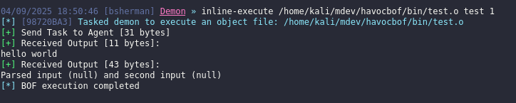
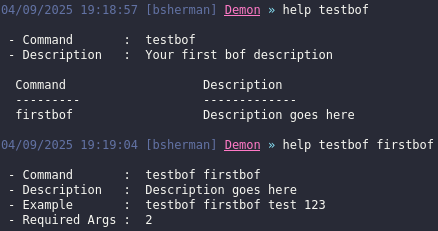
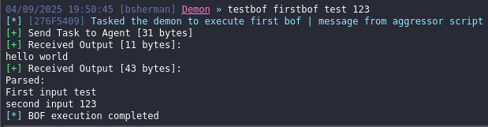

## Beacon Object File (BOF)
[back to blog](../blog.md)

Beacon Object Files are used by Command and Control (C2) frameworks such as Cobalt Strike, Havoc, Sliver, and others to perform post exploitation activities directly on a compromised host. A BOF is essentially a small Common Object File Format (COFF) program, written in C, that the Beacon/agent can load and execute in memory. The Beacon acts as a linker and loader, allowing operators to extend its functionality with custom code without producing standalone executables or DLLs. This makes BOFs a lightweight and stealthy way to run post exploit activities such as process injection, credential dumping, situational awareness, or privilege escalation during red-team operations.

Advantages
- Does not use fork and run. Fork and run creates a process and performs a process injection to run post exploitation. Which leads to a stealthier execution.
- BOF are small making them quick to transfer and execute.
- Extends C2 functionality.

Disadvantages
- limited on C programming.
- A bit hard to debug in my opinion, specially if it crashed the beacon will also crash resulting into losing access on the host. 
- Not ideal for a large project.

more information at [cobalt strike user guides](https://hstechdocs.helpsystems.com/manuals/cobaltstrike/current/userguide/content/topics/beacon-object-files_main.htm)

## Environment

The blog will focus on making a havoc BOF. For the first BOF it will be focused on the passing arguments and aggressor script (not sure what it's called on havoc but on Cobalt strike it's called like that so lets just call it the same lol). 

Before we start my lab setup is like this.
- Windows dev box
- kali linux
- Target machine (optional) 

On my windows dev box I have all my programming stuff related in here and debugging tools. The tools I had are:
- Visual studio with C installed
- python3
- x64dbg
- process hacker
- bof-vs (optional) [bof-vs](https://github.com/Cobalt-Strike/bof-vs)
- Turn off the AV for now.

There are other tools but those are what I ussually use on my windows dev box.

On my Kali
- havoc c2 server and client
- havoc profile generator (optional) [profile-generator](https://github.com/Ghost53574/havoc_profile_generator)
- python
- gcc-mingw-w64-x86-64 (for cross compiling)
- loader (optional)
- beacon.h [beacon.h](https://github.com/Cobalt-Strike/bof_template/blob/main/beacon.h)

## Creating first BOF

I actually got used compiling my BOF on my kali since it saves me sometime transferring the object file. But it's up to you whether you want to do it on windows or kali, but I will recommend trying to use bof-vs since it also had boflint [boflint](https://www.outflank.nl/blog/2025/06/30/bof-linting-for-accelerated-development/)

Below is the starting template for our BOF. As observe instead of void "main" we used go. In BOF the void go is the main function and the entry point.

```c
#include <windows.h>
#include "beacon.h"

void go(char* args, int argc){
    
    datap parser;
    char * Strinput;
    int Intinput;

    //Beacon data parser
    BeaconDataParse(&parser, args, argc);
    Strinput = BeaconDataExtract(&parser, NULL);
    Intinput  = BeaconDataInt(&parser);

    //prints hello world
    BeaconPrintf(CALLBACK_OUTPUT, "hello world");

    //prints out message to demon console
    BeaconPrintf(CALLBACK_OUTPUT, "Parsed:\nFirst input %s \nsecond input %d ", Strinput, Intinput);
}
```

to compile run the command below.

```bash
x86_64-w64-mingw32-gcc -c src/test.c -w -o bin/test.o
```

## Aggressor script

Next that we need to build is the aggressor script. You can test your newly created beacon by using inline-execute.



Below is the template for our havoc aggressor script.

```py
from havoc import Demon, RegisterCommand, RegisterModule

def run_firstbof(demon_id, *args):
    
    task_id: str = None
    demon: Demon = None
    packer: Packer = Packer() 
    # Get the beacon instance
    demon = Demon(demon_id)

    # packs the user input from C2 client
    packer.addstr(args[0])
    packer.addint(int(args[1]))

    # prints out to the demon console
    task_id = demon.ConsoleWrite(demon.CONSOLE_TASK, f"Tasked the demon to execute first bof | message from aggressor script")
    
    # executes demon inline-execute
    demon.InlineExecute(task_id, "go", "bin/test.o", packer.getbuffer(), False)

    return task_id

#I maybe wrong on the naming but here is how I understand it.
#RegisterCommand(pyfunction, "<modulename>", "command name", "description can be seen via help <modulename>", <not sure>, "shows an example usage command can be seen via help <modulename> <command name>", "example command to execute just the args ")
RegisterModule( "testbof", "Your first bof description", "", "", "", ""  )
RegisterCommand(run_firstbof, "testbof", "firstbof", "Description goes here", 0, "usage: ", "test 123")
```

to load the script click Scripts (will open script manager) > Load script > and load the python script. On my havoc c2 there is a bug wherein if you try to load a script sometimes it can't be seen even if you refresh it on the script manager so I had to re open the client or the server.



For more reference on what you could use for demon execution, I typically check the github source code [havoc source code](https://github.com/HavocFramework/Havoc/blob/main/client/src/Havoc/PythonApi/PyDemonClass.cc) and then look at the PyDemonClass_methods. There are more to dig in and if you need something definitely checkout the source.



I learned from the following links below. Also from CRTO, CRTO2, ODPC, maldev academy and reading source code and understanding what they do.
- https://github.com/HavocFramework/Modules
- https://www.100daysofredteam.com/p/creating-a-simple-beacon-object-file-for-havoc-c2
- https://lorenzomeacci.com/the-havoc-framework
- https://havocframework.com/docs/object_files

Next up is creating BOF with winapi for a process injection.
[Go to Next](procinjbof.md)

[back to blog](../blog.md)