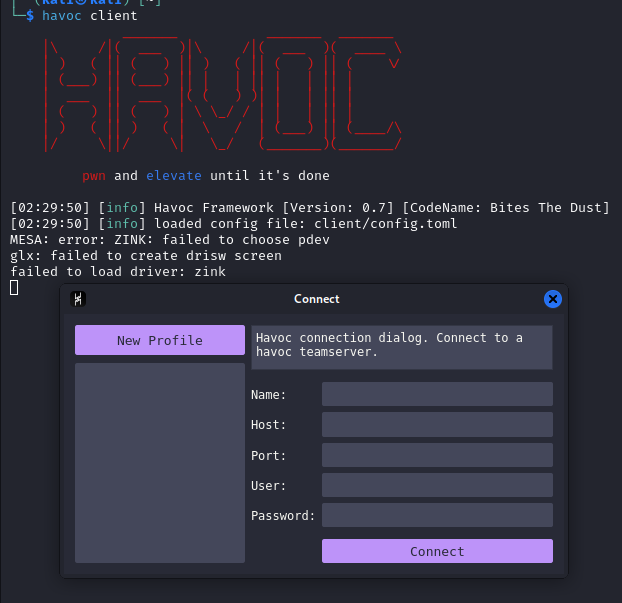
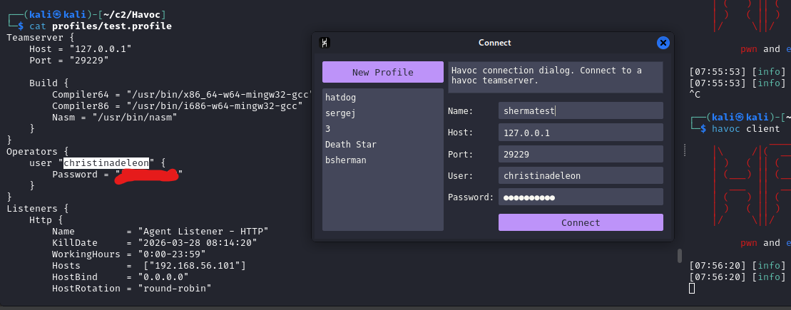

## under development
[back to blog](../blog.md)


The post will focus on Havoc C2.

* [Getting started](#havoc-installation)
* [Profile configuration](#profile-configuration)
* Payload generation
* Agent
* [BOF](../BOF/intro.md)
* Infrastructure setup
  * VPN
  * [Redirector](redirector.md)

## Havoc installation

Follow the installation on the official wiki. [Havoc wiki installation](https://havocframework.com/docs/installation).

Or in kali you can use apt install havoc. The only caveat in using this is, it's using an old version [Havoc repo kali](https://www.kali.org/tools/havoc/). `version: 0.6~git20240910.69ce17c arch: amd64`

```bash
kali> havoc                                                      
Command 'havoc' not found, but can be installed with:
sudo apt install havoc
Do you want to install it? (N/y)
```

After installing we got our team server and client.

## Team server

```bash
havoc --help
Havoc Framework [Version: 0.7] [CodeName: Bites The Dust]

Usage:
  havoc [flags]
  havoc [command]

Available Commands:
  client      client command
  help        Help about any command
  server      teamserver command

Flags:
  -h, --help   help for havoc

Use "havoc [command] --help" for more information about a command.
```

The team server is the core part in all C2, this is where you generate your payload, set up listeners, interacts with agents and etc.
[Team server](https://havocframework.com/docs/teamserver)

Ideally the team server should be located/placed locally and should not expose any port in the internet/publicly. This helps ensuring that the C2 server is safe from threat actors, BOTS and etc. Another considerisation should be noted is that the server where you install the C2 teamserver should be fully patched, follows best practice and security hygiene just to ensure the it is hardened.

(Optional) As for experiment you could try getting a VPS, use virustotal to check the IP and observe. Then install metasploit or any C2 and then create a listener. Wait for a few days and observe that the IP reputation of the IP/domain would be malicious, bots are also trying to connect on the exposed port and exploiting it.

## Client

The havoc client is used for connecting into the C2 server. Each operator can connect to the server as long as it reach the connection port for the C2. The client also provide a GUI for the operator to interact with the C2 functionalities. [Havoc client](https://havocframework.com/docs/client)



## Profile configuration

Creating profile is one of the most important thing in C2, this allows the operator to have malleability in C2, allowing them to customize the user agent, headers and etc. to blend in the network, set the behavious of the payload like where it injects, set the section to RWX false, remove strings and many more. [havoc profile](https://havocframework.com/docs/profiles)

Unfortunately in havoc c2 (community), just adding the community word here because there is an upcoming havoc pro and it's not released yet as the time of writing. So going back, in havoc c2 only offers a couple of modification you could do on the payload and other functionalities unlike in cobalt strike you have a wide range of stuffs you could use such as

Preventing the use of RWX when the payload gets executed, have obfuscate and cleanup, have a smart inject and many more. TLDR CS profile have a configuration for stage, post exploitation, process injection, and etc. [CS profile](https://hstechdocs.helpsystems.com/manuals/cobaltstrike/current/userguide/content/topics/malleable-c2_main.htm)

If you want to know more about the profile you can check out these blogs from WhiteKnightLabs (WKL), I will be also adding some parts I learned there in our profile so it's good to have a read of it.

* https://whiteknightlabs.com/2023/05/23/unleashing-the-unseen-harnessing-the-power-of-cobalt-strike-profiles-for-edr-evasion/
* https://whiteknightlabs.com/2025/05/19/harnessing-the-power-of-cobalt-strike-profiles-for-edr-evasion-part-2/

So for now we will start first, by using the havoc profile generator to get a base profile and then moving forward we will be editing the parts of it. [Havoc profile generator](https://github.com/Ghost53574/havoc_profile_generator)

```bash
git clone https://github.com/Ghost53574/havoc_profile_generator

cd havoc_profile_generator
pip3 install -r requirements.txt
```

```bash
python3 havoc_profile_generator.py -h
usage: Havoc profile generator [-h] [-c CONFIG] [-r READ] [-l [LIST]] [-s [SYSNATIVE]] [-a ARCH] [-p PROFILE] [-H HOST] [-S HOSTS] [-P PORT] [-L LISTENERS] [-E [EVASION]] [-M MPORTS] [-o OUTFILE] [-q [QUIET]]

Generate havoc c2 profiles with ease and randomness

options:
  -h, --help            show this help message and exit
  -c CONFIG, --config CONFIG
                        Config file to use, don' use a conifg file for a completely random profile
  -r READ, --read READ  Directory to read CS profiles from
  -l [LIST], --list [LIST]
                        List supported profiles
  -s [SYSNATIVE], --sysnative [SYSNATIVE]
                        Only support sysnative for spawn to
  -a ARCH, --arch ARCH  Selected architecture between x86, x64 & x86_64
  -p PROFILE, --profile PROFILE
                        Select a traffic profile
  -H HOST, --host HOST  The listeners ip
  -S HOSTS, --hosts HOSTS
                        The hosts array in the form of 10.0.0.1,10.0.0.2
  -P PORT, --port PORT  Set the port for listeners to listen on
  -L LISTENERS, --listeners LISTENERS
                        Set the port for listeners to listen on
  -E [EVASION], --evasion [EVASION]
                        Set beacon defaults to be more evasive
  -M MPORTS, --mports MPORTS
                        Set's the min port and max port for randomization
  -o OUTFILE, --outfile OUTFILE
                        Output file of the final Havoc C2 pofile
  -q [QUIET], --quiet [QUIET]
                        Do not show banner

```

You can use the same command as below or use your own preffered command. This will generate the havoc profile.

```bash
python3 havoc_profile_generator.py -E -S 192.168.56.101 -o test.profile
```

after generating the profile rerun the server and connect to it. The code snippet below shows how to start the teamserver with the newly generated profile

```bash
havoc server --profile profiles/test.profile --debug
```


## Interacting with Agent


[back to blog](../blog.md)