## under development
[back to blog](../blog.md)

Disclaimer: This blog is for educational purposes only. The author does not condone or support illegal activity, use the information responsibly and only in environments you own or have explicit written permission to test. 

All examples shown here are drawn from the author’s self-study for red-teaming certifications and from technical blogs; environments demonstrated are owned by the author and hosted in virtual machines locally. The author accepts no responsibility or liability for any actions taken by readers that violate applicable laws, regulations, or terms of service.

The main purpose of this blog is to share knowledge about Havoc C2 and it's setup.

* [Infrastructure setup](#setup)
* [Domain](#domain)
* [VPS config](#vps-config)
  * [adding domain](#adding-domain)
  * [Linux VM](#linux-vm)
    * [HTTP/HTTPS redirector](#httphttps-redirector)
    * [Web server config and SSL](#web-server-config-and-ssl)
    * [Redirector setup](#redirector-setup)
    * [Testing the redirector](#testing-the-redirector)
    * [Redirection rules and hardening](#redirection-rules-and-hardening)
  * [OpenVPN](#OpenVPN)
    * [OpenVPN configuration](#openvpn-config)
    * [Testing connectivity](#testing-connectivty)
* [FW rule](#fw-rule)
* [Serverless Redirector](redirector.md)

# setup

The blog contains setup that will use the following.

* Cloudflare for purchasing the domain and obtaining a certificate. (If you want to test purely locally, you’ll need multiple VMs or machines and a DNS solution such as PowerDNS.)
* VPS for HTTP/HTTPS redirector
* 1 more Redirector - still checking if AWS, DO or azure serverless. 
* VPS for OpenVPN to connect the C2 server and operator access.
* 1 VM C2 server hosted locally.
* 1 VM for C2 operator.
* 1 Target machine hosted locally, ideally on a separate physical machine or a cloud VM (AWS/Azure). Note that testing on cloud VMs may require prior permission see AWS penetration testing guidelines for details: [AWS pentest guidelines](https://aws.amazon.com/security/penetration-testing/) check the simulated events.

Why am I sharing this notes ? well it's to help other pentester/red teamer or people doing certs related to red teaming. I’m still learning, so some OPSEC trade-offs or imperfect practices may appear.

Below screenshot is the ideal infrastructure setup. Looking at this graph probably some of you would think that deploying openvpn on cloud is not a good idea well I will agree with that. Ideally you would want to have a tunnel/connection on a controlled environment to ensure that data in transit is secured, but since I dont know how to setup that locally or have the correct appliance. I used cloud for the meantime. 

One reason why I used VPN is to give flexibility. Allowing the operator to connect remotely. Ideally it's good to have the connection on both local network, but **I like working from home lol** so lets setup a VPN. Another thing to note on free OpenVPN subscription only 2 users are allowed to have connection.

Another thing I am thinking in here is probably you could drop a device like lan turtle or mini PC or any hardware that could give you connection back. It could be either like doing a tunneling or connecting to VPN allowing the team gaining access on internal network.


| Title                          | Description |
|--------------------------------|-------------|
| Green arrow              | connection to openvpn, this allow the operator to connect on to the C2 server remotely without having to go onsite or on the same local network. **Work From Home Banzai!**
| Red arrow | Callback connection from the target, as notice there is an optional connection. This optional connection could be used for round robin, allowing the agent to connect either on the serverless or HTTPS redirector. If it connects on the serverless redirector it will pass the traffic to HTTPS redirector and then to C2.
| Dark arrow | remote portforward of C2 HTTPS 443 listener to localhost 8443 of the VPS redirector, allowing the apache redirection rule to redirect the traffic to localhost 8443 to get a callback.

In my opinion having 2 redirector with this setup is better than a single redirector. The reason behind this is, if we use a redirector thats comes from a trusted provider such as AWS,Azure, and etc. This gives a better chance of blending into the local network traffic and potentially this IP could be whitelisted internally. Another thing is that we also have a failover or backup if something shit goes wrong. 


# Domain

When purchasing a domain for red teaming infrastructure, there are several important considerations to weigh to improve operational reliability, reduce detection risk, and avoid rapid takedowns.


| Title                          | Description |
|--------------------------------|-------------|
| Domain fronting                | Domain fronting is a technique that attempts to hide the true destination of network traffic by making the connection appear to go to a trusted, well-known hostname (such as a major CDN), while the request is internally forwarded to a different backend hostname. It’s used to blend malicious or sensitive traffic into normal-looking traffic, evade simple host-based blocking, or bypass censorship. [Domain fronting](https://bigb0ss.medium.com/redteam-c2-redirector-domain-fronting-setup-azure-adbedbd28305), [Domain fronting 2](https://www.zscaler.com/blogs/security-research/analysis-domain-fronting-technique-abuse-and-hiding-cdns). |
| Domain aging                   | Older, legitimately aged domains generally have better reputations and are less likely to be blocked immediately. Check historical usage (archive.org, passive DNS) before buying. |
| Domain categorization          | Security vendors and web filters categorize domains (example: malware, news, gambling). Verify category/reputation with reputation services to avoid instant blocking. [Domain categeroziation](https://tools.zvelo.com/). |
| Registrar blocking / takedown risk | Some registrars respond quickly to abuse complaints. Choose a reputable registrar, read their abuse/TOS policies, and plan backups in case of suspension. Another thing to note here, these registrars search for keywords or phrases that are commonly used for phishing or used by malwares or bots. |
| TLD choice                     | Some TLD are closely monitored or commonly abused. Use mainstream or context-appropriate TLD (.com, .org, regional TLDs) for better blend in the network. |
| DNS reputation & hosting       | Where you host DNS affects credibility. Reputable DNS providers (Cloudflare, Route53, etc.) look more legitimate than obscure/cheap providers associated with abuse. |
| SSL / TLS certificate          | Use certificates from trusted CAs (Let’s Encrypt, commercial CAs) to avoid TLS errors and reduce suspicion. Self-signed certs are more likely to be flagged. |
| WHOIS privacy                  | Privacy protection hides registrant details but can sometimes raise suspicion. Balance anonymity with perceived legitimacy depending on the engagement. |
| Cost & burn rate               | Expect some domains to "burn" quickly. Budget for replacements, consider domain lifecycle, and plan redundancy (multiple domains/hosts). |


Since this will be just an example, I will not wait for a long time to have a domain aging or categorization.

The example will use cloudflare because, I find it easy to manage the domains here and it gives other features such as domain privacy and stuffs.

Create an account to cloudflare, go to domain registration > register domains and look for your preffered domain. So after searching, I found a domain for $7.52/year which is the cheapest I could found. Probably there are more cheaper. 

Complete all the fields and buy it, if you are decided.

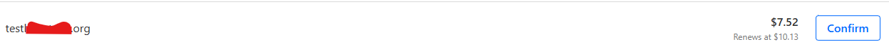

After buying a domain, next thing to do is add whois privacy it's up to you if you want to, but again you need to balance anonymity if you are doing a red teaming. But since this is just an example I will add whois privacy.

To add whois privacy check the link [whois redaction](https://developers.cloudflare.com/registrar/account-options/whois-redaction/). Adding redaction is pretty easy you simply just add your domain and select whois.

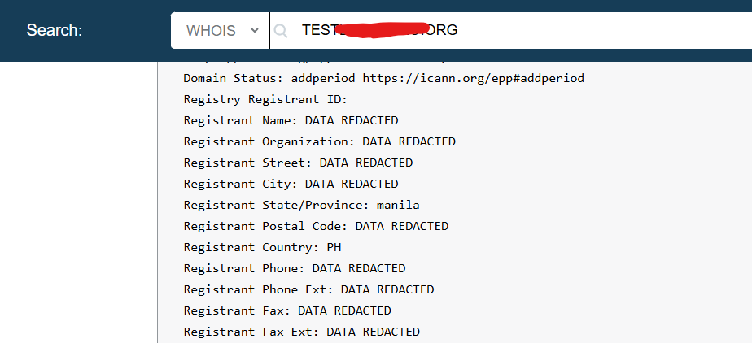

Running whois command on kali

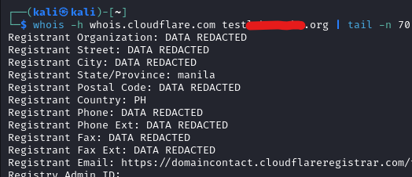

Another thing you could do is to enable DNSSEC on managed domain > configuration. DNSSEC uses a cryptographic signature of published DNS records to protect your domain against forged DNS answers.

Next is you could block the AI training bots on the overview or in AI crawl control. But you need a robots.txt for this. Next create a DMARC record for added security to prevent spoofing ensure that to reject it even though we are not going to use the domain for mailing.

```bash
p=reject; sp=reject; aspf=s;
```

* p=reject – Policy for the main domain (example.com). Reject emails that fail DMARC.
* sp=reject – Policy for subdomains (*.example.com). Reject spoofed emails from subdomains.
* aspf=s – SPF alignment mode set to strict. The "From" domain must exactly match the SPF-authenticated domain.

Next add a new DNS TXT record. The record below means, no server is allowed to send mail on behalf of your domain.

```bash
"v=spf1 -all"
```

So if you go back now to your DMARC management you should see something like this.

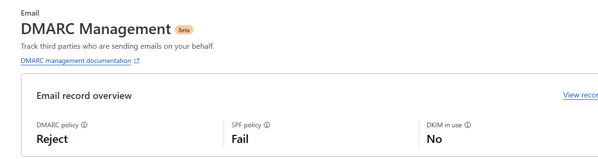


# VPS config

In this example I will be using digital ocean droplets. Create an account on digital ocean, create a project and add your domain.

## Adding domain

To add your domain go to Networking > domain > add domain. 

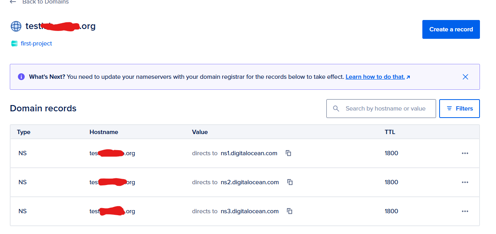 

After adding the domain add the NS records on cloudflare.

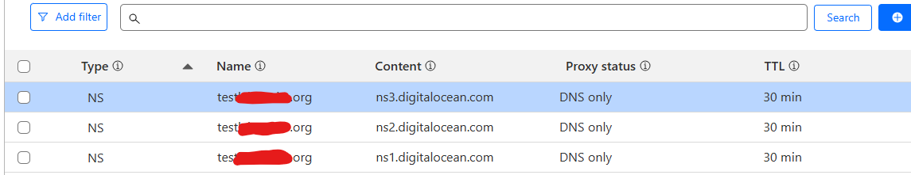

## Linux VM
## HTTP/HTTPS redirector
This first VM will be for HTTP/HTTPS redirector. A redirector is a public-facing proxy that receives agent traffic, forwards it to the hidden teamserver, and helps protect OPSEC by isolating the core C2, blending traffic, and making infrastructure easier to rotate or replace.

There are opensource tools you could use for setting up redirector such as apache,nginx,caddy,flask and etc. [Red caddy](https://github.com/XiaoliChan/RedCaddy), [Serverless ](https://github.com/RedSiege/AutoFunkt/tree/main)

This section will cover the HTTPS redirector configuration.

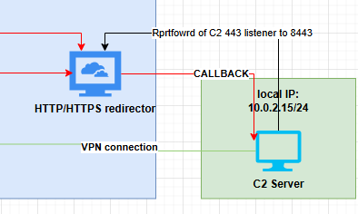

For the droplet I will be using ubuntu and the cheapest one. 

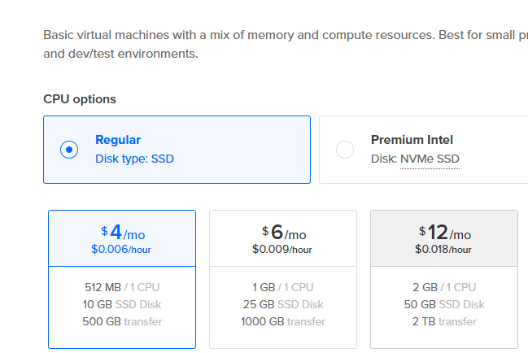

As for the authentication choose ssh keys and add your public keys.

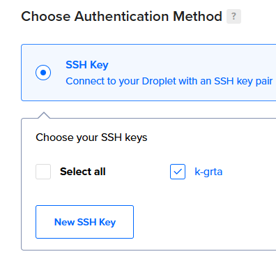

After creating the droplet ssh into it. Next update and upgrade it

```bash
ssh -i id_rsa root@<IP>

apt update
apt upgrade
```

Next edit the SSH config and change the ssh port to another port.

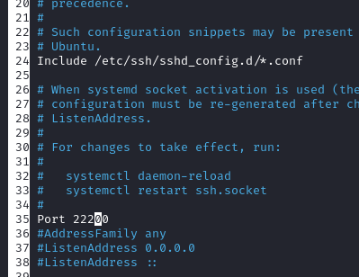

Next ensure that password auth is not enabled you could check it on ssh config or via nmap

```bash
nmap -p 22200 --script=ssh-auth-methods <IP> -sV -vv -Pn 

PORT      STATE SERVICE REASON  VERSION
22200/tcp open  ssh     syn-ack OpenSSH 9.9p1 Ubuntu 3ubuntu3.2 (Ubuntu Linux; protocol 2.0)
| ssh-auth-methods: 
|   Supported authentication methods: 
|_    publickey
Service Info: OS: Linux; CPE: cpe:/o:linux:linux_kernel
```

For more server hardening you can add a new users disable root and ensure that you follow least privilege principle.

## Web server config and SSL

Next install apache2 and create a symlink on ssl config file.

```bash
apt install apache2 # install apache2
a2enmod ssl rewrite proxy proxy_http #enables Apache modules for SSL/TLS, URL rewriting, and HTTP proxying, allowing secure connections, redirects, and proxying requests.
systemctl restart apache2 # restart apache2
cd /etc/apache2/sites-enabled/ # change directory to sites-enabled
rm 000-default.conf # remove the default config
ln -s ../sites-available/default-ssl.conf . # create a symlink to ssl conf
systemctl restart apache2 # restart the apache server again
```

Next on your cloudflare dashboard add a new **"A"** record as shown from the screenshot below. `A www <iP>`. Ensure that it's not proxied or else you will have a problem when accessing the website.


Open the browser and type your domain you might see something like "ERR_SSL_VERSION_OR_CIPHER_MISMATCH". But when you type the IP address directly you can see the ubuntu default page. So lets fix that ERROR.

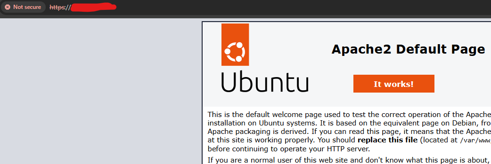

To fix this lets use certbot to get a certificate. But first add a vhost.

Edit the **default-ssl.conf** and add the following. One reason why we adding the port 80 because the certbot will check this vhost if it not exist it will fail.

```bash
<VirtualHost *:80>
    ServerName example.com
    ServerAlias www.example.com

    DocumentRoot /var/www/html

    ErrorLog ${APACHE_LOG_DIR}/example.com-error.log
    CustomLog ${APACHE_LOG_DIR}/example.com-access.log combined
</VirtualHost>

Also make sure to add the servername and serveralias on 443 vhost
```

Next install certbot and request a cert via certbot. 

```bash
apt install certbot python3-certbot-apache -y
certbot --apache -d www.example.com
```

After debugging the **"ERR_SSL_VERSION_OR_CIPHER_MISMATCH"** I realised, I proxied my DNS record to cloudflare which is why It's giving an error but anyway if you got at this point you must have the SSL/TLS. As shown from the screenshot below I got the SSL from lets encrypt.

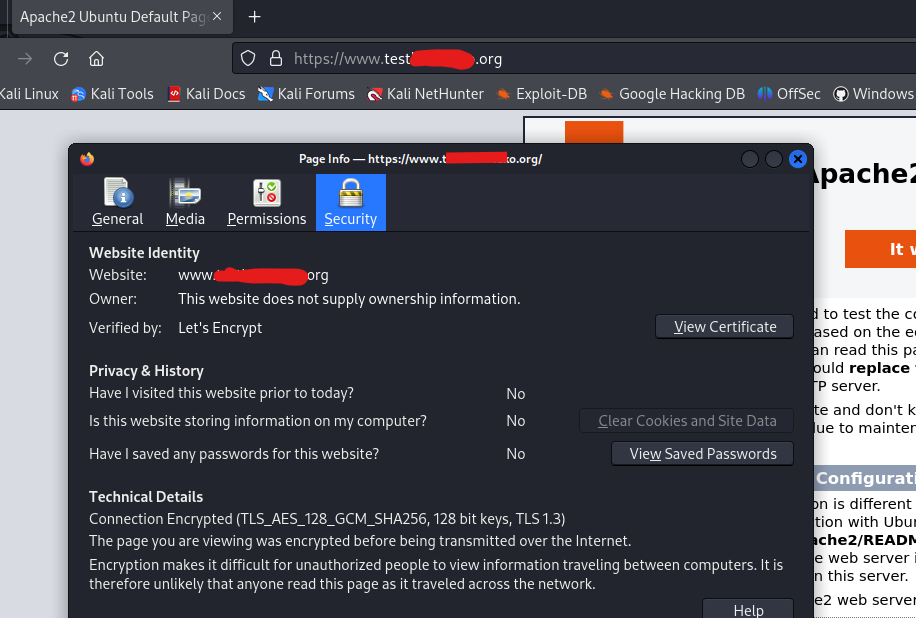

## Redirector setup

First open the C2 server and forward your listener to the HTTP/HTTPS server. You could do this by using the command below.

So what the command below does, it forwards the port 443 of C2 server to the redirector server and start it on 8443 locally.

```bash
ssh -i id_rsa root@<IP> -p 22200 -R 8443:localhost:443

root@http-s-redir:~ ss -tunlp | grep 8443
tcp   LISTEN 0      128        127.0.0.1:8443       0.0.0.0:*    users:(("sshd-session",pid=5405,fd=9))             
tcp   LISTEN 0      128            [::1]:8443          [::]:*    users:(("sshd-session",pid=5405,fd=8))
```

If you curl the 8443 it will give you SSL error, so we need to fix this one as well.

```bash
curl https://127.0.0.1:8443
curl: (60) SSL certificate problem: self-signed certificate
More details here: https://curl.se/docs/sslcerts.html

curl failed to verify the legitimacy of the server and therefore could not
establish a secure connection to it. To learn more about this situation and
how to fix it, please visit the webpage mentioned above.
```

In my previous blog about [Havoc c2](havoc2.md) we generated a local SSL. Transfer the files in the vps and do the following.

```bash
cp havoc.crt /usr/local/share/ca-certificates/ # copy the havoc.crt on to share ca-cert
update-ca-certificates # update the newly added cert

rehash: warning: skipping ca-certificates.crt, it does not contain exactly one certificate or CRL
1 added, 0 removed; done.
Running hooks in /etc/ca-certificates/update.d...
done.

```

## Apache redirection

Go to your HTTP/HTTPS redirector and edit the default-ssl.conf. Add **"SSLProxyEngine" under SSLEngine and before the closing tag of \</VirtualHost>, add the \<Directory>**. 

```bash
<VirtualHost *:443>
<SNIPPED>
SSLEngine on
SSLProxyEngine on
<SNIPPED>

<Directory /var/www/html/>
    Options Indexes FollowSymLinks MultiViews
    AllowOverride All
    Require all granted
</Directory>

</VirtualHost>
```

Next go to /var/www/html and add a .htaccess. Add the following. Then restart the apache.

```bash
RewriteEngine on
RewriteRule ^.*$ https://localhost:8443%{REQUEST_URI} [P]
```

To ensure that redirection works start a python webserver on port 443 and make a curl request to your domain.

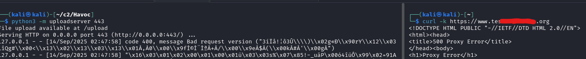

Next edit your c2 profile add your domain on host and then generate a new payload. Execute it on your target machine to ensure that your redirector works.

```bash
Listeners {
    Http {
        Name         = "Agent Listener - HTTP"
        KillDate     = "2026-03-28 08:14:20"
        WorkingHours = "0:00-23:59"
        Hosts        =  ["www.test<REDACTED>.org"]
```


## Testing the redirector

Open the teamserver, generate a payload and observe while it compiles, you should see it uses your domain as host.

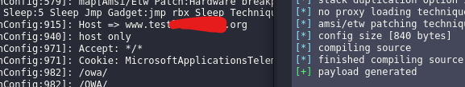

The screenshot below shows a succesfull callback to C2 server.

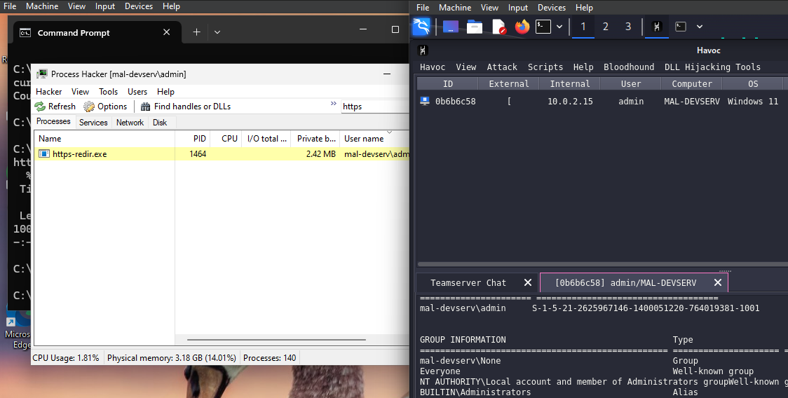

Running wireshark on the target machine, we can confirm that the communication goes into redirector.

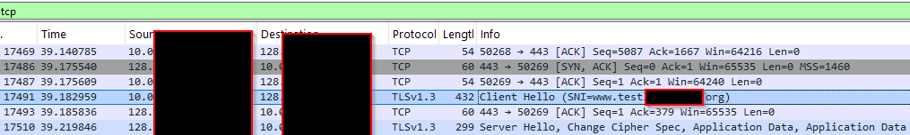

## Redirection rules and hardening

So now everything works fine, but we need to make more rules to avoid bots going into the server and flooding it with requests.

First of all let's add robots.txt. This give instructions to search engine crawlers about which parts of your site they can or cannot index.

On your HTTP/HTTPS redirector. Go to /var/www/html and add a robots.txt. This blocks all crawlers from indexing any path on your domain

```bash
User-agent: *
Disallow: /
```

Next we need to modify the apache rule redirection. So the idea here is, if it does not meet the required headers,path and useragent it will be redirected into a diversion page which is our landing page. If it's correct it will go into the Havoc C2.

Another thing to note here is that we must match the profile and the apache redirection rule strictly. So only the callback will be redirected and anything else is redirected to landing page or into a 404.

Below is my havoc profile HTTPS configuration.

```bash
        UserAgent    = "Mozilla/5.0 (Windows NT 6.1; WOW64) AppleWebKit/537.36 (KHTML, like Gecko) Chrome/96.0.4664.110 Safari/537.36"
        Uris         =  ["/owa/", "/OWA/"]
        Headers      =  ["Accept: */*", "Cookie: MicrosoftApplicationsTelemetryDeviceId=95c18d8-4dce9854;ClientId=1C0F6C5D910F9;MSPAuth=3EkAjDKjI;xid=730bf7;wla42=ZG0yMzA2KjEs"]
```

Below is my apache .htaccess config.

```bash
RewriteEngine On

# Match only the specific User-Agent
RewriteCond %{HTTP_USER_AGENT} ^Mozilla/5\.0\ \(Windows\ NT\ 6\.1;\ WOW64\)\ AppleWebKit/537\.36\ \(KHTML,\ like\ Gecko\)\ Chrome/96\.0\.4664\.110\ Safari/537\.36$ [NC]

# Match Accept header
RewriteCond %{HTTP:Accept} \*/\* [NC]

# Match Cookie header (must contain all tokens)
RewriteCond %{HTTP:Cookie} MicrosoftApplicationsTelemetryDeviceId=95c18d8-4dce9854 [NC]
RewriteCond %{HTTP:Cookie} ClientId=1C0F6C5D910F9 [NC]
RewriteCond %{HTTP:Cookie} MSPAuth=3EkAjDKjI [NC]
RewriteCond %{HTTP:Cookie} xid=730bf7 [NC]
RewriteCond %{HTTP:Cookie} wla42=ZG0yMzA2KjEs [NC]

# Match only the given URIs
RewriteCond %{REQUEST_URI} ^/(owa|OWA)/ [NC]

# Action: proxy the request to localhost:8443 (change as needed)
RewriteRule ^.*$ https://localhost:8443%{REQUEST_URI} [P,L]
ErrorDocument 404 /custom_404.html
```

Next change the default apache page and change it into a landing page. Below screenshot is the landing page.

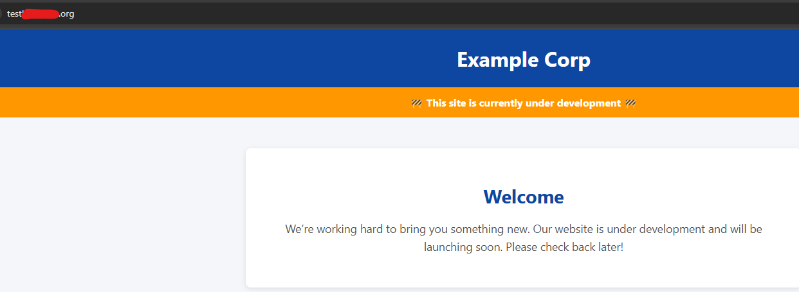

Below screenshot shows different curl requests with successful and failed request.

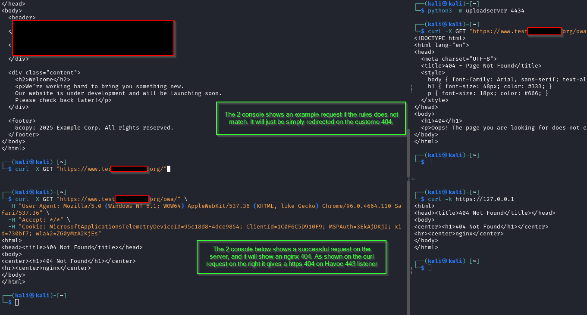

Check your callback if it's working.

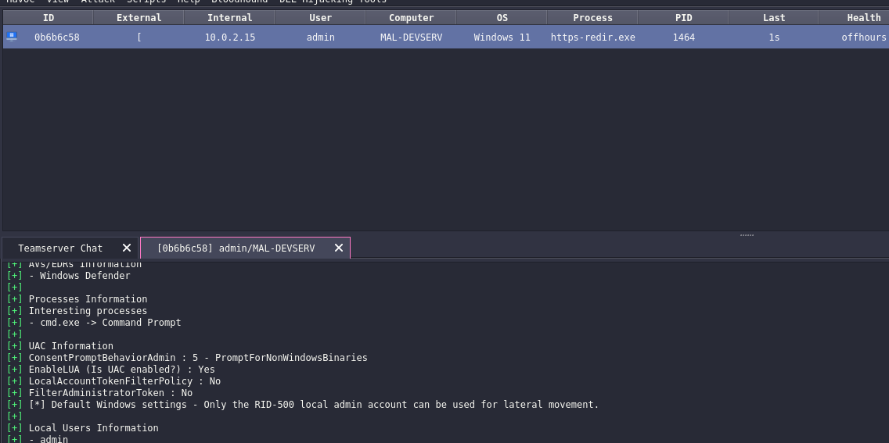

There are more ways to do this like using proxypass [Proxypass](https://www.optiv.com/insights/discover/blog/redirectors-red-teamers-introduction).


Just adding a random anime gif for no reason. Anime name is **"chinmoku no majo"** just think of it bocchi the rock but it can cast spells.


## OpenVPN

This section will discuss about the connectivity of C2 operator and C2 server. Also do the same hardening we made on the redirector. No need to do the apache config.

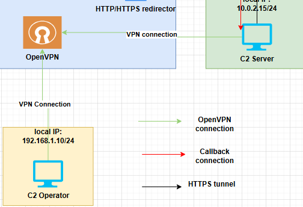

Go to Digital ocean and create a new droplet. On market place search for openvpn, then deploy the droplet.

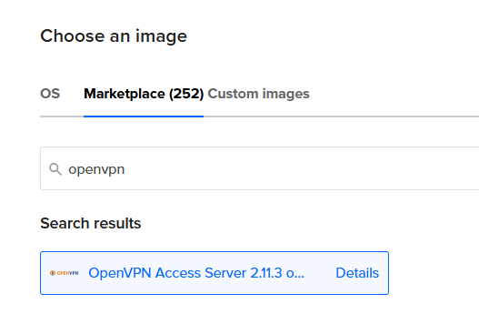

SSH to the new droplet and configure it the way you like. It will ask you a series of question. Nooooo quiizzzz from openvpn lol

```
Terms and Cond: yes

Will this be the primary Access Server node?: yes

Please specify the network interface and IP address to be used by the Admin Web UI: I choosed all interface here. (later on we will configure it to restrict some access)

Then the rest will just be default, press enter. This will generate a password for openvpn (which is your admin) make sure to save that password
```

Next reconnect to the ssh and port forward the port 943. For later we will use this to access the admin dashboard locally when we restrict public access.

```bash
ssh -i id_rsa root@<IP> -L 943:127.0.0.1:943

if you can't still reach the port 943, try doing dynamic proxy just add -D <port> then edit your proxychains config then try to connect on that host.
```

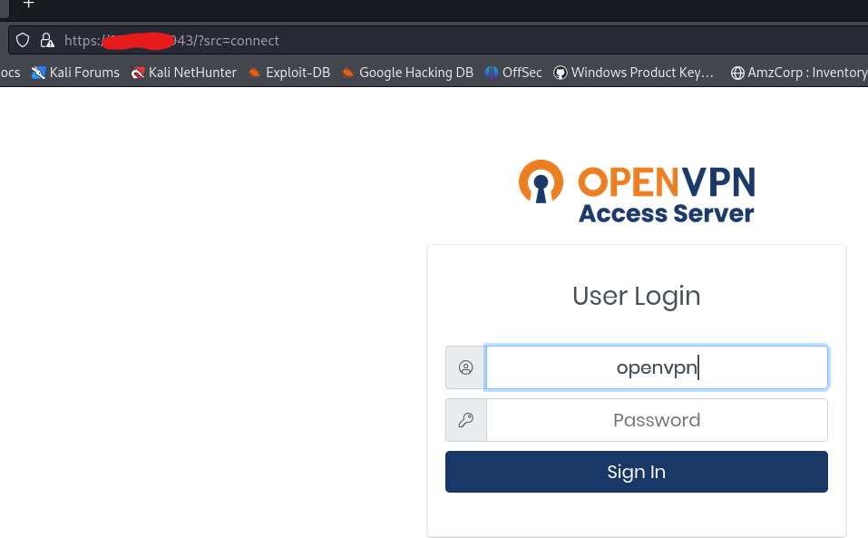

## OpenVPN config

First go to /admin and login. Then go to configuration > network settings, then change the admin port to another port you like or leave it as default. On the client webserver change it to use a different IP or port. 

For the VPN server change it to listen to all interfaces, change the IP to the server IP address. Next dont forward the client and admin web server, so the  login page is not exposed publicly this will still open port 443 for daemon openvpn service.


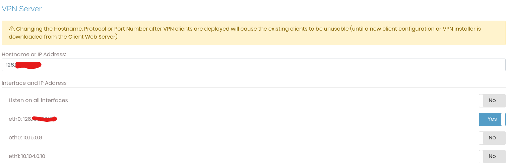

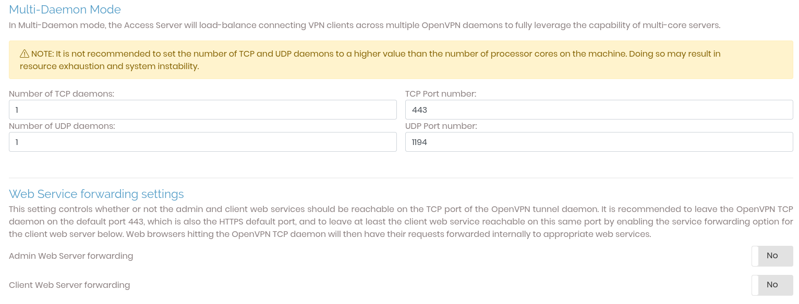

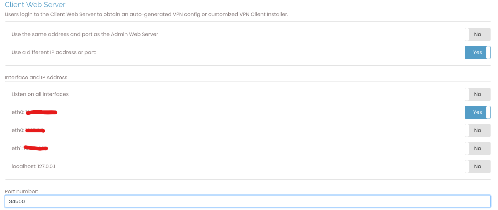

If you need to managed the ovpn server do a local portforward and you will stil be able to login.

Go to VPN settings > DNS Settings and then press yes to **Do not alter clients' DNS server settings**

On advanced VPN connection > go to "**Inter-Client Communication**" > enable the "**Should clients be able to communicate with each other on the VPN IP Network?**" or the other one, but just make sure the connecting one is from admin.

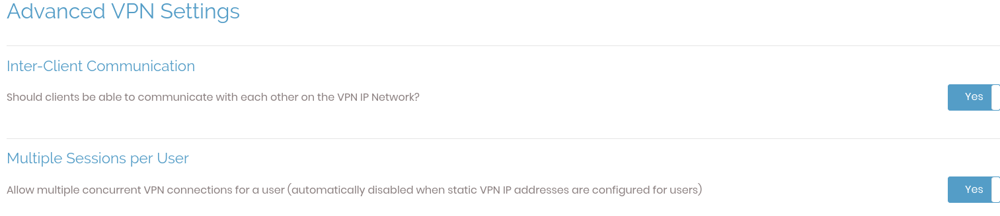

There are more configuration you should check for hardening and the example I made is simply for making a connectivity from C2 and operator.

Next go to user management and add a new user. Click the User settings and add password.

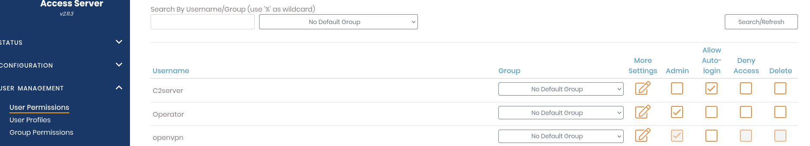

After that go to user profiles > click new profile, this will download a new openvpn 
* User locked - will ask for credentials. All admin requires auth.
* Auto login - will just automatically login.

Before you connect perform a port scan and try to access the exposed port if it shows the login page you must reconfigure the openvpn server or add a firewall rule.

## Testing connectivty

```bash
Download the OVPN on the C2 server and connect to it.

sudo openvpn C2server.ovpn

2025-09-14 07:43:34 net_route_v4_add: 0.0.0.0/1 via 172.27.232.1 dev [NULL] table 0 metric -1
2025-09-14 07:43:34 net_route_v4_add: 128.0.0.0/1 via 172.27.232.1 dev [NULL] table 0 metric -1
2025-09-14 07:43:34 Initialization Sequence Completed

ifconfig | grep tun0 -A 5
tun0: flags=4305<UP,POINTOPOINT,RUNNING,NOARP,MULTICAST>  mtu 1500
        inet 172.27.232.3
```

on the operator machine download the operator openvpn and connect to it. Enter the credentials.

```bash
sudo openvpn operator.ovpn

Enter Auth Username: Operator
Enter Auth Password: ••••••••••••

025-09-14 07:48:25 net_route_v4_add: 0.0.0.0/1 via 172.27.232.1 dev [NULL] table 0 metric -1
2025-09-14 07:48:25 net_route_v4_add: 128.0.0.0/1 via 172.27.232.1 dev [NULL] table 0 metric -1
2025-09-14 07:48:25 Initialization Sequence Completed
```

Next, since the C2 server is listening locally, open an ssh server on the C2 server. Make sure it's hardened and follows best practice as outlined in this blog. Make sure to have a fail2ban, one of the reason why I did not install this because of the VPS storage. It could eat a lot of space because of the logs.

On operator server

```bash
ssh -i id_rsa newuser@<C2vpnIP> -L 29229:127.0.0.1:29229

havoc client

Then connect to the havoc client on port 29229
```

As shown on the screenshot below it managed to connect to the c2 server via ssh.

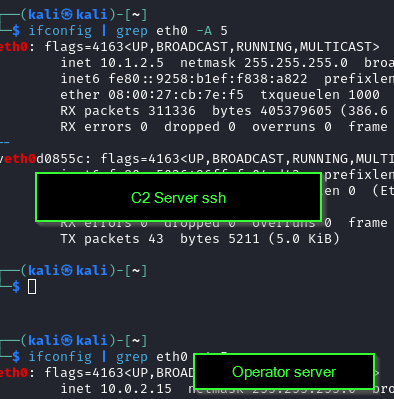

Below screenshot show succesful connection on C2 server with openvpn. Note that to connect 2 user you must edit the profile and add a new user.

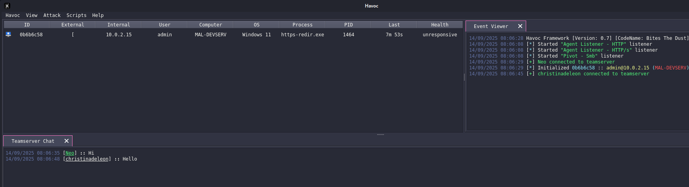

However as shown from the screenshot above we can see that the beacon is not responding anymore to fix this do the following.

Go to VPN settings > routing > **disable should client internet traffic be routed through the VPN?**. As of now I cant find a workaround to have this enabled and make the redirector connected as well. For the meantime disable it.

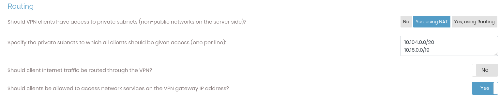

Then try to get another beacon and make sure it connects on the redirector and everthing works fine.

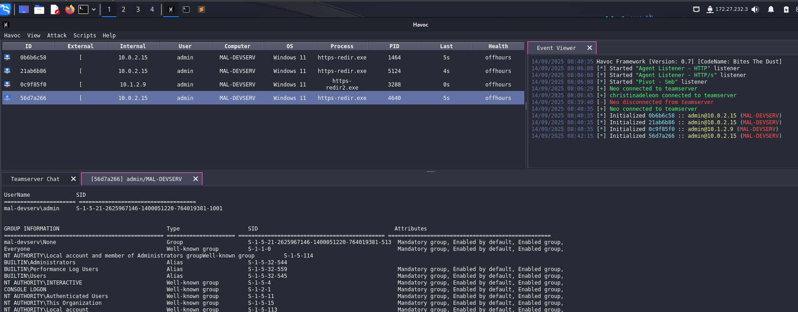

To check current user connected on openvpn, go to Status > current user.

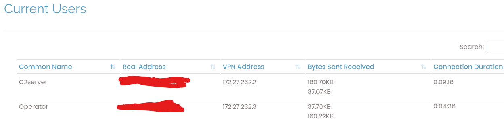

## FW rule

Lastly FW rule, this section will configure the digital ocean FW to disable ssh access on openssh server and only allow whitelisted IP.

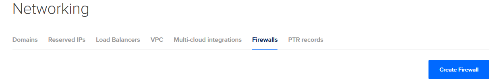

An example FW rule could be used as shown below. You can simply just add the specific IP of the operator and c2 server or IPs you owned.

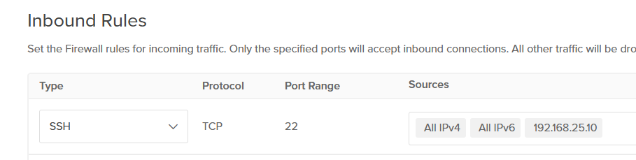

Another example you could do for openvpn is shown below. This configuration only allows inbound traffic to port 443 for openvpn and nothing else. Ideally you shouldnt allow all IPv4 and you should only add specific IP. 

Whenever you need to do a configuration for openvpn you can just enable the inbound access to ssh.

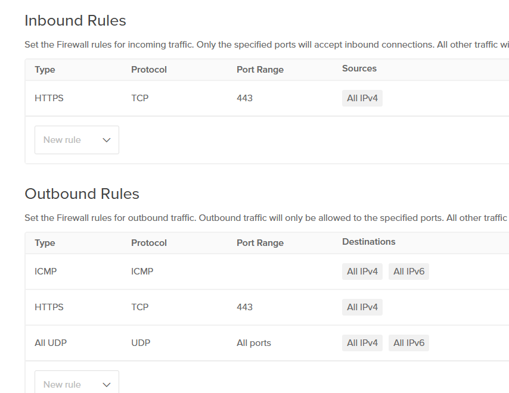

A firewall rule you could do for redirector is the same as shown above, but note that port 80 and 443 should accepts inbound traffic on all IP or if you know the target IP or region IP. 

Lets say the IP we expect, should come from the philippines then you should only allow PH IP. For the SSH firewall you could do the same with openvpn config.

Next blog will be configuring the serverless redirector.

[next blog](redirector.md)

## Resources
https://github.com/bluscreenofjeff/Red-Team-Infrastructure-Wiki


[back to blog](../blog.md)

