[back to blog](../blog.md)

* [Interacting with agent](#interacting-with-agent)
  * [Process list](#process-list)
  * [File explorer](#file-explorer)
  * [Interact](#interact)
* [View tab](#view)
  * [listeners](#listeners)
  * [session view](#session-view)
  * [Loot](#loot)
  * [Teamserver](#teamserver)
* [Attack tab](#attack-tab)
  * [payloads](#payload)
  * [extensions](#extensions)
* [Scripts](#scripts)
  * [Script manager](#script-manager)
  * [script console](#script-console)

For this post, you will need 1 target machine (of course its something you own or its from CTF) and 1 kali machine for C2. Spin up the two vm, generate a payload, transfer it and execute it on the target matchine. You can turn off the AV or your endpoint security for the meantime since this blog is not focused yet on evading. That topic will be covered in another blog post. 

As usual always check the wiki. [Havoc wiki](https://havocframework.com/docs/agent)

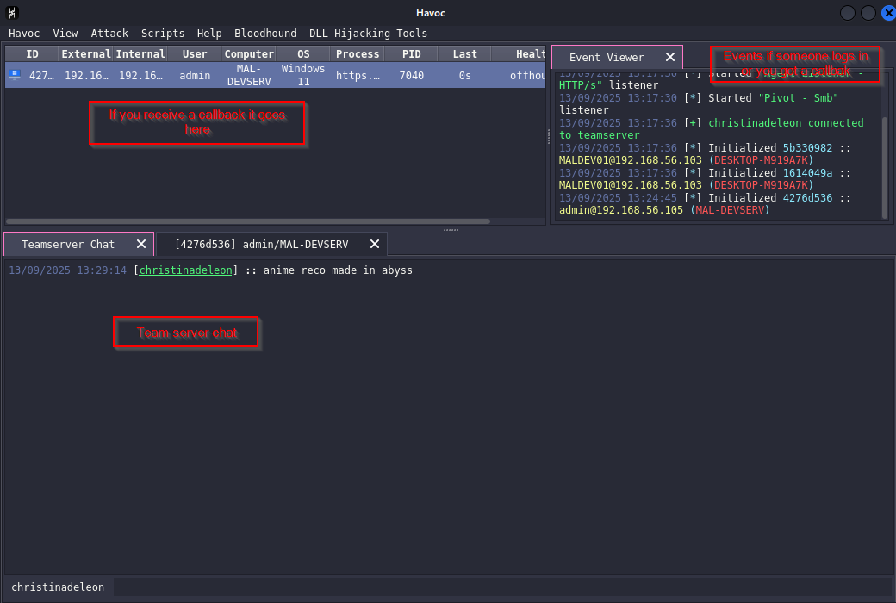

# Interacting with agent

If you right click on the agent you can do some of the following:

* Interact - in here you executes commands, bof and etc.
* Explorer - can give you a nice gui list of processes and file explorer.
* Mark as dead - if you mark as dead an agent and click remove, on the next start of the C2 server it will be remove.
* Color - Adds a color on each agent, 1 nice way I could think of in here is you can organize your agent based on the domain where it lands on.
* Remove - it removes the agent on the list, you can't remove an agent if you did not mark it as dead, if you remove it without marking and it's still running it will still pop up in the list.
* Exit - gives you a way to terminate the agent either via thread or process

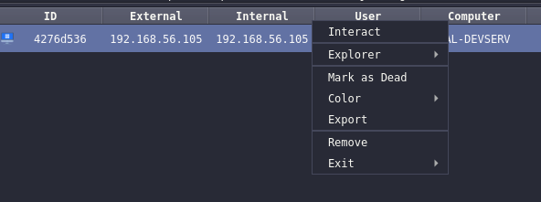

## process list
Process list, in the process list you can right click and copy the process ID.

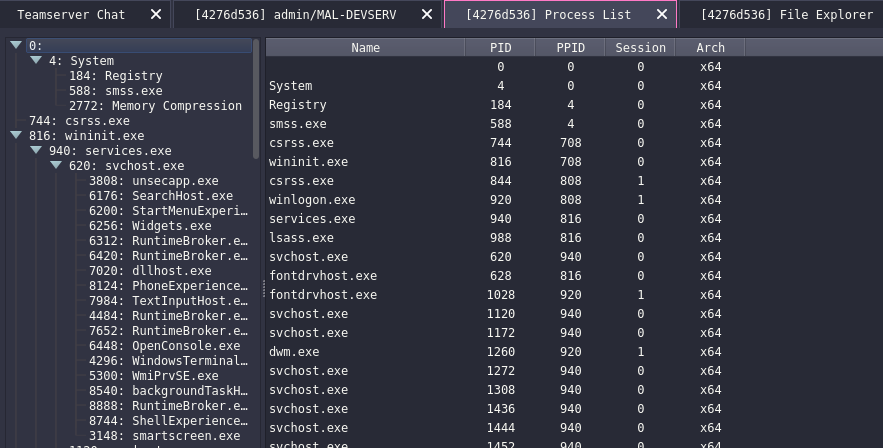

## file explorer
When you right click on a file you could download or reload it.

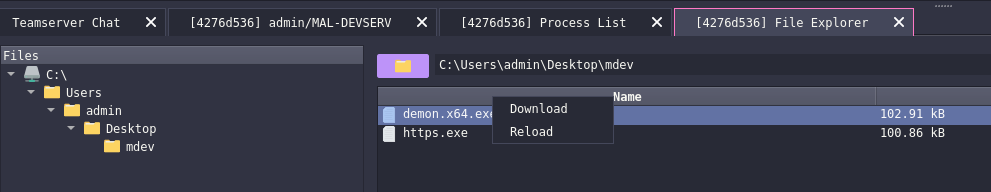

## interact

If you type help it will show the list of commands you could execute on the agent, this includes BOF as well. You can also use this to change the sleep seconds of your agent.

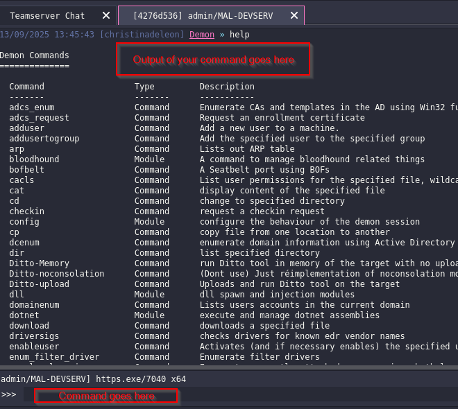

example command executed. **bofbelt**. You can see that it gives a nice information about the host and the user.

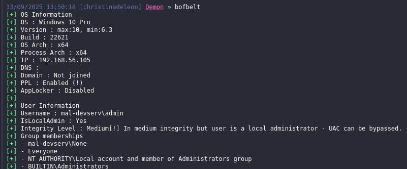

Another thing that I want to highlight in here is the **dotnet** command. This command allows you to execute .NET assemblies in memory. Lets say for example you need to use sharpup you could use `dotnet inline-execute /home/kali/others/ad/SharpUp.exe`. 

* dotnet inline-execute - executes assembly in the current process and gets output
* dotnet execute - executes a dotnet assembly in a seperate process

To know how to use a command `help <command name>`

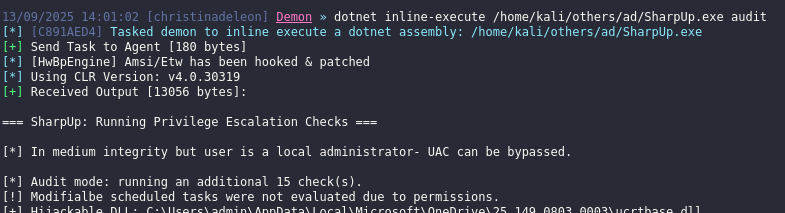

The only thing that I dont like about the dotnet execute, it could take a while before you get an output and sometimes you wont know if it crashed or got detected by AV because when I was doing a pro labs I waited for like 10 mins to get a callback but nothing. Worth to read and it might be because of the payload configuration [Combining the pieces](https://mannyfreddy.gitbook.io/ya-boy-manny#combining-the-pieces)

Lastly if you want to execute a shell or powershell command you could use the command below

* shell - for cmd commands
* powerpick - for unamanged powershell commands, unfortunately havoc c2 does not support how the cobaltstrike handles powershell module. In cobalt strike you could do powershell-import to import a powershell module on the current agent and execute that module via powerpick.

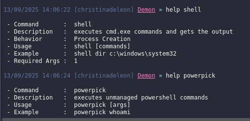

# View

This view tab could allow you to check the teamserver debug, modify listeners, check the loot and change how the agent views.

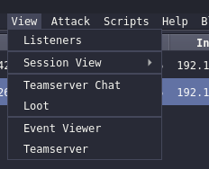

## Listeners

Since our listener was made from the profile generated, you could add, edit or delete listeners here. If you forgot the parameters of this listener I highly suggest you check out the previous blog post [havoc2](havoc2.md). Currently it had http, https, smb and external. 

I havent fully explored yet what external is or the full capability of it but based on the documentation it **allow third-party programs to act as a communication layer for Havoc's Demon agent and registered service agents.**

[havoc wiki listener external](https://havocframework.com/docs/listeners)

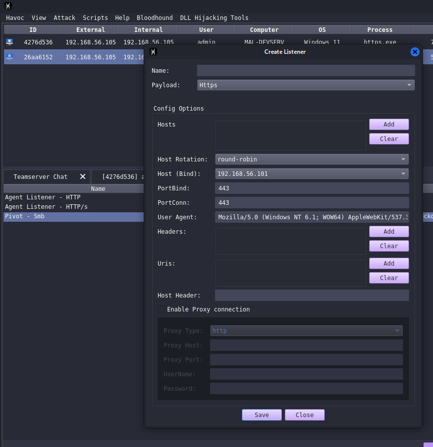

## session view

Session view change how the agent view you could make it a graphical or table view. I like the table view the most since it's easy to interact and find the agent you need.

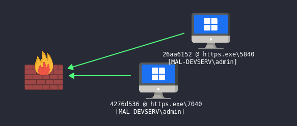

Another thing to note here if the computer or ID name is in red color it means you have a high privilege user. It could be an admin or NT service that you could use to elevate into NT authority.

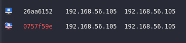

## Loot

The loot gives you the view or list of screenshot or downloads you executed on the agent.

## teamserver

The teamserver allows you to see the debug of agent, when you are compiling the payload, executing command, an agent is connected and so on. This is very useful when it comes to debuging.

# attack tab

Attack tab allows you to generate a payload and customize it based on what is available, and extends the c2 capability by installing extensions and bofs. 

Note that Havoc C2 was not designed to be evasive but it's made to be malleable allowing operators to add their modules to evade their targets. https://github.com/HavocFramework/Havoc?tab=readme-ov-file#note

## payload

I discussed a few of them on previous blog when we are configuring the profile. So I will go through some of the thing that I havent discussed yet. I highly suggest to read the documentation about [havoc agent](https://havocframework.com/docs/agent).

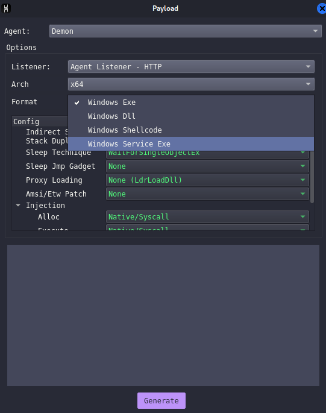

* Indirect syscalls - Indirectly call the native windows api such as NtAllocateVirtualMemory by routing the call through another layer rather than calling the API symbol directly. This can mean using techniques such as calling through a function pointer or trampoline(JMP) [Indirect syscalls](https://redops.at/en/blog/direct-syscalls-vs-indirect-syscalls), [indirect syscalls2](https://www.crow.rip/nest/mal/dev/inject/syscalls/indirect-syscalls)
* Stack duplication - Used for avoiding detection during sleep [Stack duplication](https://catdev.io/blog/post-1/)
* Amsi/ETW patch - bypass the in-process telemetry/monitoring such as Windows AMSI (Antimalware Scan Interface) and ETW (Event Tracing for Windows) so that malicious payloads avoid detection or logging.
* Native syscall - Use NTApis instead of the regular winAPIs for example (Virtualalloc -> NtAllocateVirtualMemory)

You can also choose whether to use x64 or x86, and choose the format it could be DLL, shellcode or service exe.

The Windows service exe is used for exploiting/abusing services for privesc and could be use for pivoting similar to CS [Service exe](https://pikaroot.github.io/_blogs/2023-02-25-HAVOC_Framework)

## Extensions

Too lazy to modify my network to make it fetch for extension (I am using host only adapter so it doesnt have internet) but what was listed there could be found here [havoc store](#https://p4p1.github.io/havoc-store/)

Just feel like adding it here even thou I have internet lol

Note that you need internet to install. This extension allows you to install BOF, or other functionalites like mitre4havoc. Basically it extends the capability of havoc.

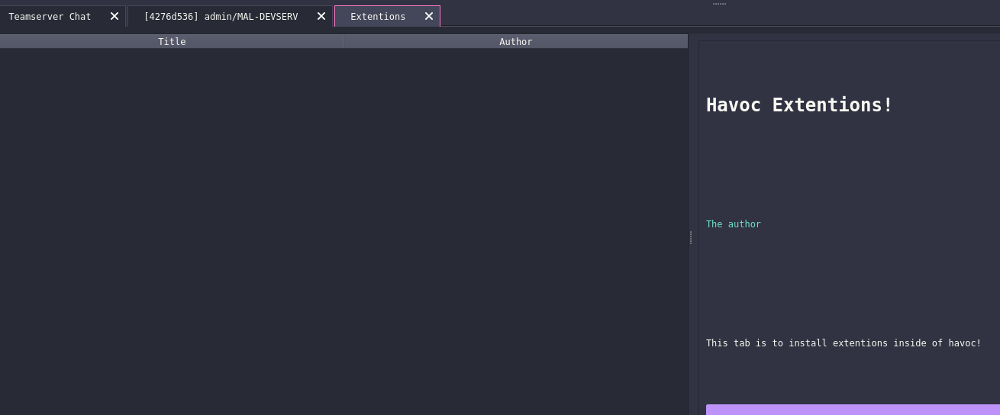

# Scripts

On this tab, you manage the BOF or extension for your C2.

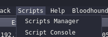

## script manager

On script manager you can load the aggressor script for BOF, or for the extension allowing the operator to extend the capability of the C2. If you want to know how to create BOF checkout this blog [BOF](../BOF/intro.md)

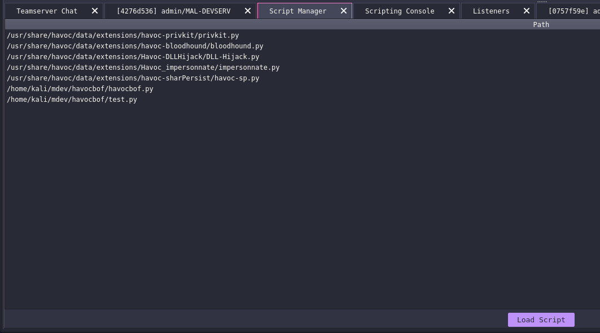

## script console

Script console gives you a python like shell, this allows you to communicate with the havoc python api. [havoc python api](https://leosmith.wtf/blog/havoc-c2-pythonapi.html)

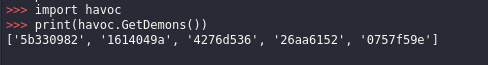

Next post is about infrastructure setup. I’m still learning, so some OPSEC trade-offs or imperfect practices may appear.
[Go to Next](Infrastructure-setup.md)

[back to blog](../blog.md)